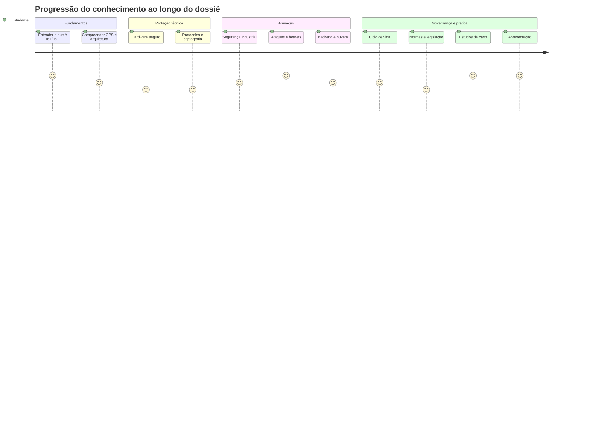
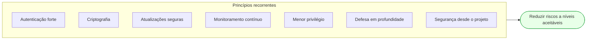

# 🧭 Contexto Detalhado do Repositório — IoT Knowledge Hub

> Documento de referência que descreve **todo o conteúdo** do repositório: propósito, estrutura, mapa conceitual, resumo de cada volume, glossário e índice de diagramas.
> Serve como ponto de entrada para leitura, revisão e navegação rápida.

---

## 1. Identificação

| Campo | Valor |
| ------- | ------- |
| **Repositório** | IoT Knowledge Hub |
| **Disciplina** | Internet das Coisas (IoT) |
| **Instituição** | Instituto de Informática — Universidade Federal de Goiás (UFG) |
| **Período** | 2026/3 (Férias de Inverno) |
| **Curso** | Engenharia de Computação |
| **Autor** | Higor Ferreira Silva |
| **Documento principal** | Dossiê Técnico — Segurança da Informação em Dispositivos IoT |
| **Idioma** | Português (Brasil) |
| **Formato** | Markdown com diagramas Mermaid |

---

## 2. Propósito do repositório

Trata-se de uma **base de conhecimento acadêmica** — não um repositório de código ou projeto de software. Seu objetivo é reunir, organizar e documentar o conhecimento produzido na disciplina de IoT, com foco em **Segurança da Informação em Dispositivos IoT**.

O material foi concebido como apoio para:

- seminários e apresentações;
- monitorias;
- atividades de sala de aula invertida;
- discussões em grupo;
- consulta futura (disciplinas correlatas, iniciação científica, TCC).

---

## 3. Estrutura física

```text
.
├── README.md              → visão geral, índice e navegação
├── CONTEXTO.md            → este documento (contexto detalhado)
└── Dossie/
    ├── Parte 1/
    │   ├── Volume 1.md     → Fundamentos da Segurança em IoT e IIoT
    │   ├── Volume 2.md     → Hardware Seguro e Raiz de Confiança
    │   └── Volume 3.md     → Protocolos, Criptografia e Comunicação Segura
    ├── Parte 2/
    │   ├── Volume 4.md     → Segurança Industrial (IIoT) e Purdue
    │   ├── Volume 5.md     → Ataques Reais, Botnets e Modelagem de Ameaças
    │   └── Volume 6.md     → Cloud, Edge, APIs, Observabilidade e Resposta a Incidentes
    └── Parte 3/
        ├── Volume 7.md     → Ciclo de Vida Seguro dos Dispositivos IoT
        ├── Volume 8.md     → Normas, Frameworks e Legislação Internacional
        ├── Volume 9.md     → Estudos de Caso e Aplicações Práticas
        └── Volume 10.md    → Guia para Apresentação e Sala de Aula Invertida
```

> **Nota de formatação:** o Volume 1 abre com o cabeçalho geral do dossiê (título, tema, objetivo). Os arquivos estão nomeados com algarismos arábicos, mas os títulos internos usam numeração romana (Volume I–X).

---

## 4. Mapa conceitual do dossiê

```mermaid
flowchart TD
    ROOT([Segurança da Informação em IoT])

    ROOT --> F[Fundamentos]
    ROOT --> HW[Hardware Seguro]
    ROOT --> COM[Comunicação Segura]
    ROOT --> IND[Segurança Industrial]
    ROOT --> ATK[Ataques e Ameaças]
    ROOT --> BE[Backend e Nuvem]
    ROOT --> LC[Ciclo de Vida]
    ROOT --> GOV[Normas e Governança]
    ROOT --> APP[Aplicações Práticas]

    F --> F1[IoT × IIoT]
    F --> F2[Sistemas Ciberfísicos]
    F --> F3[Edge/Fog/Cloud]

    HW --> H1[Root of Trust]
    HW --> H2[Secure Boot / Flash Encryption]
    HW --> H3[Secure Element / TPM / TrustZone]

    COM --> C1[MQTT / CoAP / OPC UA]
    COM --> C2[TLS / DTLS / OSCORE]
    COM --> C3[PKI / mTLS / OTA]

    IND --> I1[TI × OT]
    IND --> I2[ICS / SCADA]
    IND --> I3[Modelo Purdue / Segmentação]

    ATK --> A1[Botnets / Mirai]
    ATK --> A2[DDoS]
    ATK --> A3[STRIDE / OWASP / MITRE]

    BE --> B1[Device Twin]
    BE --> B2[APIs / BOLA / OAuth2]
    BE --> B3[SIEM / Observabilidade]

    LC --> L1[Secure by Design/Default]
    LC --> L2[CVE / CVSS / SBOM]
    LC --> L3[OTA / Descomissionamento]

    GOV --> G1[NIST CSF / IR 8259]
    GOV --> G2[ISA/IEC 62443 / ETSI]
    GOV --> G3[LGPD / GDPR / CRA]

    APP --> P1[Smart Home / Cidade]
    APP --> P2[Hospital / Indústria]
    APP --> P3[Veículos / Energia / Logística]
```



---

## 5. Resumo executivo de cada volume

### Parte I — Fundamentos

**Volume I — Fundamentos da Segurança em IoT e IIoT.**
Conceitua IoT e sua evolução histórica (4 gerações), diferencia IoT de IIoT, apresenta os Sistemas Ciberfísicos (CPS) e a distinção Security × Safety, descreve a arquitetura em camadas e o continuum Edge/Fog/Cloud, e introduz o modelo de ameaças STRIDE. *Dado de contexto: ~21,1 bilhões de dispositivos IoT em 2025 (IoT Analytics).*

**Volume II — Hardware Seguro e Raiz de Confiança.**
Mostra que a segurança começa no silício: identidade digital (certificados X.509, factory provisioning), Root of Trust, cadeia de confiança, Secure Boot, Flash Encryption, eFuses, Secure Element, TPM, ARM TrustZone. Aborda ataques físicos (side-channel, fault injection), engenharia reversa e interfaces de depuração (UART/JTAG/SWD).

**Volume III — Protocolos, Criptografia e Comunicação Segura.**
Cobre a tríade CIA aplicada à comunicação, protocolos leves (MQTT, CoAP, OPC UA, DDS, AMQP), protocolos industriais legados, e mecanismos criptográficos: TLS 1.3, DTLS, OSCORE, PKI, certificados X.509, autenticação mútua (mTLS) e atualizações OTA seguras.

### Parte II — Ambientes e Ataques

**Volume IV — Segurança Industrial (IIoT) e Arquitetura Purdue.**
Diferencia TI × OT (prioridades CIA invertidas), apresenta os componentes ICS (PLC, RTU, DCS, IED, SCADA, Historian), a convergência TI/OT e o fim do "air gap", o Modelo Purdue (níveis 0–5 + DMZ 3.5), a segmentação por zonas/conduítes e a norma ISA/IEC 62443.

**Volume V — Ataques Reais, Botnets e Modelagem de Ameaças.**
Explica botnets e o modelo C2, o caso Mirai e o ataque à Dyn (2016), variantes (Mozi, Hajime, VPNFilter), DDoS, o OWASP IoT Top 10 (2018), STRIDE em detalhe, MITRE ATT&CK for ICS e estudos de caso industriais (Stuxnet, Triton, Industroyer).

**Volume VI — Cloud, Edge, APIs, Observabilidade e Resposta a Incidentes.**
Descreve o backend IoT, Digital/Device Twin, APIs REST e a vulnerabilidade BOLA, OAuth2/JWT, os três pilares da observabilidade (logs, métricas, traces), SIEM, Edge Analytics, resposta a incidentes (5 fases), rollout gradual, plataformas de nuvem e Privacy by Design.

### Parte III — Ciclo de Vida e Prática

**Volume VII — Ciclo de Vida Seguro dos Dispositivos IoT.**
Apresenta o ciclo de vida (projeto → descarte), Secure by Design, Secure by Default, provisionamento seguro, gestão de vulnerabilidades (CVE/CVSS), OTA, rotação/revogação de certificados, descomissionamento (Cryptographic Erase), Supply Chain Security, SBOM e DevSecOps.

**Volume VIII — Normas, Frameworks e Legislação Internacional.**
Compara NIST CSF 2.0 (6 funções, incluindo Govern), NIST IR 8259, ISA/IEC 62443, ETSI EN 303 645, OWASP IoT, MITRE ATT&CK, LGPD, GDPR, ISO/IEC 27001 e o Cyber Resilience Act (em vigor desde 10/12/2024; obrigações principais a partir de 11/12/2027).

**Volume IX — Estudos de Caso e Aplicações Práticas.**
Oito cenários (Smart Home, Agricultura, Hospital, Cidade, Indústria 4.0, Veículos, Smart Grid, Logística) com benefícios, ameaças, consequências e mitigações, além de uma metodologia de análise de risco em 5 perguntas.

**Volume X — Guia para Apresentação e Sala de Aula Invertida.**
Roteiros (15/30/50 min), analogias didáticas, erros conceituais comuns, banco de perguntas (frequentes e nível professor), atividades, checklist e conexão com outras disciplinas.

---

## 6. Trajetória de aprendizagem



---

## 7. Glossário essencial

| Termo | Definição resumida |
| ------- | -------------------- |
| **IoT** | Rede de dispositivos físicos que coletam, processam e trocam dados |
| **IIoT** | IoT industrial; prioriza disponibilidade e segurança operacional |
| **CPS** | Sistema Ciberfísico; integra computação e processos físicos |
| **Safety × Security** | Prevenção de acidentes × proteção contra ataques intencionais |
| **Root of Trust** | Base de confiança em hardware, imutável e mínima |
| **Secure Boot** | Impede execução de firmware não autêntico |
| **Flash Encryption** | Criptografia da memória de programa contra leitura física |
| **Secure Element / TPM** | Chips dedicados ao armazenamento de chaves e operações criptográficas |
| **TrustZone** | Isolamento por hardware (mundo seguro × não seguro) em ARM |
| **MQTT / CoAP** | Protocolos leves de mensageria (pub/sub) e REST para dispositivos restritos |
| **TLS / DTLS / OSCORE** | Mecanismos de comunicação segura (canal e objeto) |
| **PKI / X.509 / mTLS** | Infraestrutura de chaves públicas, certificados e autenticação mútua |
| **OTA** | Atualização de firmware remota (Over-The-Air) |
| **TI × OT** | Tecnologia da Informação × Tecnologia Operacional |
| **ICS / SCADA / PLC** | Sistemas e controladores industriais |
| **Modelo Purdue** | Arquitetura de referência em níveis para segmentação industrial |
| **Botnet / C2** | Rede de dispositivos comprometidos / servidor de comando e controle |
| **DDoS** | Negação de serviço distribuída |
| **STRIDE** | Modelo de ameaças (Spoofing, Tampering, Repudiation, Info Disclosure, DoS, Elevation) |
| **BOLA** | Broken Object Level Authorization (falha de autorização em API) |
| **OAuth2 / JWT** | Autorização delegada e token de acesso assinado |
| **SIEM** | Correlação e gestão de eventos de segurança |
| **CVE / CVSS** | Identificador e pontuação de gravidade de vulnerabilidades |
| **SBOM** | Inventário de componentes de software |
| **DevSecOps** | Integração contínua da segurança no desenvolvimento |
| **Secure by Design / Default** | Segurança desde o projeto / configuração segura de fábrica |
| **Zero Trust** | "Nunca confie, sempre verifique" |
| **Privacy by Design** | Privacidade incorporada desde a concepção |

---

## 8. Padrões, normas e legislações citados

| Referência | Escopo | Observação |
| ----------- | -------- | ------------ |
| **NIST CSF 2.0** | Gestão de risco (geral) | 6 funções; Govern adicionada em 2024 |
| **NIST IR 8259** | Capacidades mínimas de dispositivos IoT | Fabricantes e compradores |
| **NIST SP 800-82** | Segurança de OT/ICS | Rev. 3 |
| **NIST SP 800-193** | Resiliência de firmware | — |
| **ISA/IEC 62443** | Segurança industrial | Zonas, conduítes, Security Levels |
| **ETSI EN 303 645** | IoT de consumo | Combate senhas universais |
| **ISO/IEC 27001** | SGSI (organizacional) | Certificável |
| **OWASP IoT Top 10** | Vulnerabilidades comuns | Versão 2018 |
| **MITRE ATT&CK for ICS** | Táticas e técnicas de atacantes | Base de conhecimento |
| **LGPD (13.709/2018)** | Proteção de dados (Brasil) | — |
| **GDPR (2016/679)** | Privacidade (UE) | Influenciou a LGPD |
| **Cyber Resilience Act (2024/2847)** | Produtos digitais (UE) | Em vigor 10/12/2024; principal 11/12/2027 |
| **RFC 8446 / 7252 / 8613** | TLS 1.3 / CoAP / OSCORE | IETF |
| **OASIS MQTT 5.0** | Protocolo MQTT | — |

---

## 9. Índice de diagramas (Mermaid)

O dossiê emprega diagramas para representar visualmente conceitos. Principais tipos e onde aparecem:

| Tipo Mermaid | Uso no dossiê | Exemplos |
| -------------- | --------------- | ---------- |
| `flowchart` | Fluxos, arquiteturas, cadeias de ataque | Jornada da lâmpada (V1), cadeia de confiança (V2), handshake OTA (III), Purdue (IV) |
| `sequenceDiagram` | Interações no tempo | Handshake TLS (III), fluxo OAuth2/JWT (VI) |
| `timeline` | Linha do tempo | Marcos de ataques a IoT/ICS (V) |
| `mindmap` | Mapas mentais | STRIDE (V), referências normativas (VIII), interdisciplinaridade (X) |
| `journey` | Progressão | Trajetória de aprendizagem (este documento) |

> Todos os diagramas são renderizados nativamente pelo GitHub ao abrir os arquivos `.md`.

---

## 10. Como usar este material

| Objetivo | Sugestão |
| ---------- | ---------- |
| **Visão geral rápida** | Leia o [README](README.md) e este documento |
| **Estudo sequencial** | Siga os volumes I → X na ordem |
| **Preparar seminário** | Comece pelo [Volume X](Dossie/Parte%203/Volume%2010.md) (roteiros e analogias) |
| **Revisão pré-prova** | Use os quadros "Perguntas do professor" e o checklist do Volume X |
| **Consulta pontual** | Use o glossário (seção 7) e o mapa conceitual (seção 4) |
| **Foco industrial** | Volumes IV, VIII e IX |
| **Foco em desenvolvimento** | Volumes II, III, VI e VII |

---

## 11. Convergência dos princípios

Independentemente do volume, todo o dossiê converge para um conjunto comum de princípios de segurança:



> **Mensagem central do dossiê:** segurança em IoT não é um produto nem uma ferramenta específica, mas um **processo contínuo** de identificação, avaliação e mitigação de riscos, mantido durante todo o ciclo de vida do dispositivo.

---

*Documento gerado como material de apoio à navegação do repositório. Para o conteúdo completo, consulte os volumes do [Dossiê](README.md#-dossiê-técnico--segurança-da-informação-em-dispositivos-iot).*
