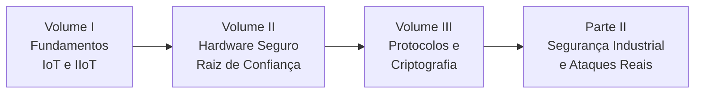
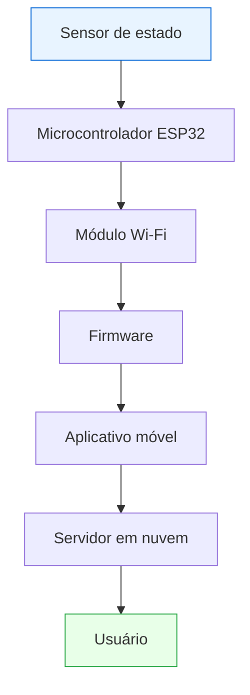
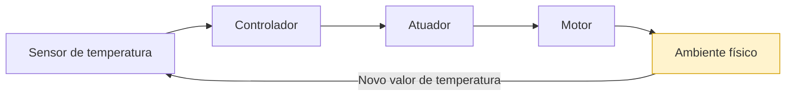
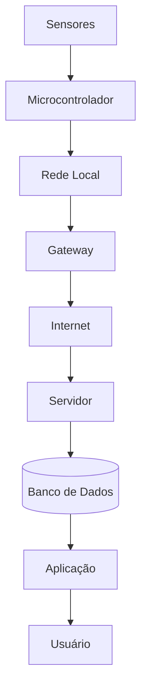
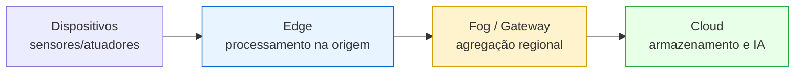
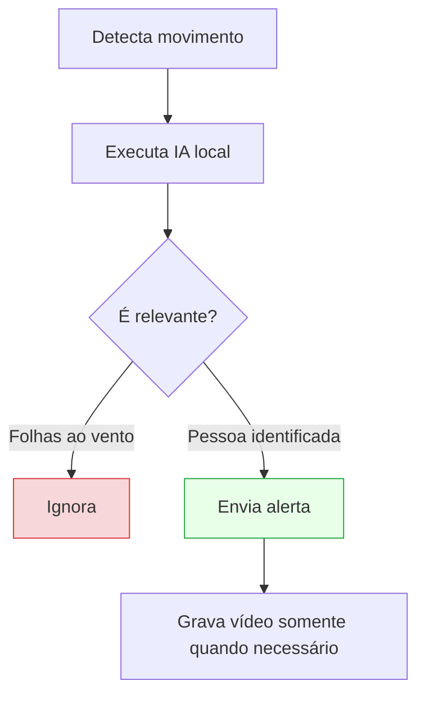

# Dossiê Técnico — Segurança da Informação em Dispositivos IoT

## Material de Apoio para Seminário, Monitoria e Sala de Aula Invertida

> **Tema:** Segurança da Informação em Dispositivos IoT
>
> **Contexto:** Análise de vulnerabilidades comuns, como botnets, e modelagem de ameaças para dispositivos domésticos e industriais conectados.
>
> **Objetivo do material:** Fornecer uma base teórica e prática para apresentações, monitorias, discussões em sala e desenvolvimento de projetos relacionados à Segurança em Internet das Coisas (IoT).

---

## Mapa da Parte I

---

## Parte I

## Volume I — Fundamentos da Segurança em IoT e IIoT

---

## 1. Introdução

A Internet das Coisas (*Internet of Things* — IoT) representa uma das maiores transformações tecnológicas das últimas décadas. Seu objetivo é conectar objetos físicos à Internet, permitindo que sensores, atuadores, dispositivos embarcados e equipamentos inteligentes coletem dados, troquem informações e executem ações automaticamente.

Embora a ideia pareça simples, seu impacto é profundo. Hoje, lâmpadas, fechaduras, câmeras de vigilância, geladeiras, veículos, sensores agrícolas, equipamentos hospitalares e máquinas industriais compartilham dados continuamente com servidores locais e serviços em nuvem.

Essa conectividade trouxe inúmeros benefícios:

- automação residencial;
- cidades inteligentes;
- monitoramento ambiental;
- agricultura de precisão;
- medicina remota;
- indústria 4.0;
- logística inteligente;
- veículos conectados.

Entretanto, quanto maior a conectividade, maior também é a superfície de ataque.

Na computação tradicional, uma invasão normalmente resulta em perda de informações, indisponibilidade de serviços ou vazamento de dados. Na IoT, os impactos podem **extrapolar o ambiente digital**.

Um invasor pode controlar uma fechadura inteligente, desligar equipamentos hospitalares, manipular sensores industriais ou assumir o controle de milhares de câmeras conectadas para formar uma botnet.

Por esse motivo, segurança em IoT não é apenas um problema de Tecnologia da Informação (TI). Ela envolve diretamente segurança física, engenharia eletrônica, sistemas embarcados, computação distribuída e sistemas ciberfísicos (*Cyber-Physical Systems* — CPS).

> **📈 Dado atual:** Segundo a IoT Analytics (*State of IoT — Summer 2025*), o número de dispositivos IoT conectados no mundo deve crescer cerca de **14% em 2025, alcançando ~21,1 bilhões**, ante 18,5 bilhões em 2024. As projeções apontam para aproximadamente **39 bilhões até 2030**. Cada novo dispositivo amplia a superfície global de ataque.

---

## Objetivos deste volume

Ao final deste capítulo o estudante deverá compreender:

- o que caracteriza um sistema IoT;
- diferenças entre IoT e IIoT;
- como ocorre o fluxo de informações;
- por que dispositivos IoT possuem desafios de segurança diferentes da computação convencional;
- principais arquiteturas utilizadas atualmente;
- conceitos fundamentais que servirão de base para todos os próximos volumes.

---

## 2. O que é Internet das Coisas?

A Internet das Coisas consiste em um ecossistema formado por dispositivos físicos capazes de perceber informações do ambiente, processar dados e comunicar-se utilizando protocolos de rede.

Esses dispositivos normalmente possuem:

- sensores;
- atuadores;
- microcontroladores;
- memória;
- interfaces de comunicação;
- firmware embarcado.

Ao contrário de computadores tradicionais, grande parte desses equipamentos executa apenas uma função específica. Exemplos:

- medir temperatura;
- detectar movimento;
- abrir uma porta;
- controlar iluminação;
- monitorar pressão;
- registrar consumo energético.

Essa especialização permite reduzir consumo de energia, custo e tamanho do hardware. Em contrapartida, limita significativamente a capacidade computacional disponível para implementar mecanismos avançados de segurança.

### Exemplo prático — a jornada de uma lâmpada inteligente

Mesmo uma ação aparentemente simples, como acender uma lâmpada utilizando um smartphone, envolve diversos componentes computacionais e múltiplas conexões de rede.

Cada uma dessas conexões representa **um possível ponto de ataque**. Um adversário poderia interceptar o tráfego Wi-Fi, comprometer o firmware, explorar a API do servidor ou sequestrar a conta do aplicativo.

---

## 3. Evolução Histórica

A IoT não surgiu de forma repentina. Sua evolução pode ser dividida em diferentes gerações.

| Geração | Período | Marcos | Característica de segurança |
| --------- | --------- | -------- | ----------------------------- |
| **1ª** | Anos 1980–1990 | Dispositivos isolados, coleta local | Sem conectividade → superfície mínima |
| **2ª** | Início dos anos 2000 | Wi-Fi, Ethernet acessível, M2M | Troca automática de dados, primeiras exposições |
| **3ª** | 2010 em diante | Smartphones, nuvem, ESP8266, Arduino, Raspberry Pi | IoT acessível ao consumidor, senhas padrão |
| **4ª** | Atualidade | Edge Computing, IA embarcada, 5G, Digital Twins, Zero Trust | Decisão local, novos vetores (IA, borda) |

> **💡 Curiosidade:** A expressão *"Internet of Things"* é atribuída a **Kevin Ashton (1999)**, no contexto de etiquetas RFID na cadeia de suprimentos da Procter & Gamble. O conceito de máquinas conectadas, porém, é anterior — a "torradeira conectada" de John Romkey (1990) é frequentemente citada como um dos primeiros dispositivos IoT.

---

## 4. IoT versus IIoT

Um erro comum é utilizar os termos como sinônimos. Embora relacionados, eles possuem objetivos bastante diferentes.

### IoT (Internet of Things)

Voltada principalmente ao consumidor. Exemplos: Smart TVs, relógios inteligentes, aspiradores robóticos, câmeras IP, tomadas inteligentes, assistentes virtuais.

O foco normalmente é conforto, automação, entretenimento e economia de energia.

### IIoT (Industrial Internet of Things)

Aplicação em ambientes industriais. Exemplos: sensores de vibração, CLPs (PLCs), robôs industriais, linhas de produção, refinarias, usinas hidrelétricas, subestações elétricas.

O foco passa a ser disponibilidade, confiabilidade, previsibilidade, segurança operacional e redução de falhas.

> Uma falha em uma residência normalmente causa inconveniência. Uma falha em uma refinaria pode causar acidentes graves e prejuízos milionários. Por esse motivo, a IIoT possui requisitos de segurança significativamente mais rigorosos.

### Comparação

| Critério | IoT | IIoT |
| ---------- | ------ | ------- |
| Público-alvo | Consumidor | Ambiente industrial |
| Prioridade | Conforto | Disponibilidade |
| Equipamentos | Baratos | Críticos |
| Atualizações | Frequentes | Mudanças controladas |
| Vida útil | Poucos anos | Superior a décadas |
| Impacto de falha | Inconveniência | Acidente / prejuízo |

---

## 5. Sistemas Ciberfísicos (Cyber-Physical Systems)

Um sistema ciberfísico integra elementos computacionais com processos físicos. Nele, software e hardware interagem continuamente com o ambiente, formando um ciclo de realimentação (*feedback loop*).

Esse ciclo ocorre continuamente. Diferentemente de aplicações tradicionais, **erros computacionais possuem consequências físicas**. Um sensor comprometido pode induzir decisões incorretas, resultando em:

- superaquecimento;
- explosões;
- desperdício energético;
- acidentes industriais.

Por isso, segurança em CPS envolve tanto cibersegurança quanto **segurança funcional (Safety)**.

> **⚠️ Atenção — Security ≠ Safety.**
> **Security** refere-se à proteção contra ataques intencionais.
> **Safety** refere-se à prevenção de acidentes, mesmo na ausência de ataques.
> Na IIoT, ambos devem coexistir.

---

## 6. Arquitetura Geral de um Sistema IoT

Embora existam inúmeras variações, a maioria dos sistemas IoT segue uma arquitetura em camadas semelhante. Quanto maior o número de componentes, maior também a superfície de ataque.

Um modelo conceitual bastante usado (ITU-T Y.2060 / arquitetura de referência IoT) organiza esses componentes em **quatro camadas**:

| Camada | Responsabilidade | Exemplo de ativo | Ameaça típica |
| -------- | ------------------ | ------------------ | ---------------- |
| **Percepção** | Sensoriamento e atuação | Sensores, atuadores | Adulteração física, spoofing de sinal |
| **Rede** | Transporte dos dados | Wi-Fi, LoRaWAN, gateways | Interceptação, MITM |
| **Processamento/Middleware** | Broker, nuvem, banco | MQTT broker, APIs | APIs inseguras, vazamento |
| **Aplicação** | Interface e lógica de negócio | App, dashboard | Autenticação fraca, BOLA |

---

## 7. Edge, Fog e Cloud Computing

Historicamente, todos os dados eram enviados diretamente para a nuvem. Essa abordagem apresentou limitações importantes: alta latência, consumo elevado de banda, dependência da Internet e custos crescentes.

Para resolver essas limitações, surgiu um **continuum de computação** entre o dispositivo e a nuvem.

### Edge Computing

O processamento passa a ocorrer próximo da origem dos dados. Uma câmera inteligente pode identificar uma pessoa localmente e, em vez de enviar horas de vídeo para a nuvem, transmitir apenas: *"Pessoa detectada às 15h42."*

Essa abordagem reduz tráfego, tempo de resposta e exposição de dados sensíveis, além de melhorar significativamente a privacidade.

### Fog Computing

Camada intermediária entre Edge e Cloud. Um *gateway* agrega informações provenientes de dezenas ou centenas de dispositivos e realiza: autenticação, filtragem, compressão, agregação, criptografia e análise preliminar. Somente informações relevantes seguem para a nuvem.

### Cloud Computing

A nuvem continua desempenhando papel essencial, fornecendo: armazenamento, análise histórica, aprendizado de máquina, gerenciamento remoto, atualização OTA, dashboards e integração entre dispositivos. Entretanto, enviar absolutamente tudo para a nuvem já não é considerado boa prática.

### Exemplo residencial

Esse modelo reduz custos e melhora a privacidade.

---

## 8. Por que IoT é mais difícil de proteger?

Ao contrário de servidores corporativos, dispositivos IoT apresentam diversas limitações:

- pouca memória RAM;
- armazenamento reduzido;
- processadores modestos;
- alimentação por bateria;
- conectividade intermitente;
- exposição física.

Além disso, muitos dispositivos permanecem instalados durante anos sem receber atualizações.

Outro desafio importante é o **custo**. Adicionar mecanismos robustos de segurança aumenta consumo energético, memória utilizada, custo do hardware e tempo de desenvolvimento. Por isso, muitos fabricantes acabam negligenciando requisitos básicos de segurança.

> **🔍 Na prática:** Uma câmera IP de baixo custo frequentemente utiliza firmware desatualizado, senha padrão, interface web insegura e criptografia inexistente. Ela pode permanecer vulnerável durante toda sua vida útil — exatamente o perfil de dispositivo explorado pela botnet Mirai (ver Volume V).

---

## 9. Modelo de Ameaças (Threat Modeling)

Nenhum sistema pode ser protegido adequadamente sem compreender quais ameaças ele enfrenta. Esse processo recebe o nome de **Threat Modeling**.

Modelar ameaças significa responder perguntas como:

- Quem pode atacar?
- Qual o objetivo do atacante?
- Quais recursos ele possui?
- Quais ativos precisam ser protegidos?
- Quais vulnerabilidades existem?
- Qual seria o impacto da exploração?

Entre os modelos mais utilizados destaca-se o **STRIDE**, criado pela Microsoft. Cada letra representa uma categoria de ameaça:

| Letra | Categoria | Propriedade violada |
| ------- | ----------- | --------------------- |
| **S** | Spoofing (falsificação de identidade) | Autenticidade |
| **T** | Tampering (adulteração) | Integridade |
| **R** | Repudiation (repúdio) | Não repúdio |
| **I** | Information Disclosure (vazamento) | Confidencialidade |
| **D** | Denial of Service (negação de serviço) | Disponibilidade |
| **E** | Elevation of Privilege (escalada) | Autorização |

Esse modelo será aprofundado no **Volume V**.

> **💡 Curiosidade — Secure by Design:** Grandes empresas iniciam a segurança ainda durante o *projeto* do dispositivo. Adicionar segurança apenas após o produto estar pronto costuma ser muito mais caro e menos eficiente. Daí surge o conceito de **Secure by Design** (aprofundado no Volume VII).

---

## Resumo do Volume

Neste primeiro volume foram apresentados os fundamentos necessários para compreender a segurança em dispositivos IoT. Foram discutidas a evolução histórica da Internet das Coisas, as diferenças entre IoT e IIoT, os sistemas ciberfísicos, as arquiteturas Edge, Fog e Cloud Computing, além dos desafios específicos enfrentados por dispositivos embarcados e uma introdução ao modelo STRIDE.

Esses conceitos servirão como base para todos os próximos capítulos, onde serão estudadas as tecnologias de proteção, as principais vulnerabilidades e os mecanismos modernos utilizados para garantir autenticidade, integridade, confidencialidade e disponibilidade dos dispositivos conectados.

---

## Perguntas para discussão

1. Todo dispositivo IoT realmente precisa estar conectado à Internet?
2. Quais riscos surgem quando uma residência possui dezenas de dispositivos inteligentes?
3. É possível garantir segurança absoluta em um dispositivo IoT?
4. Edge Computing melhora apenas o desempenho ou também aumenta a segurança?
5. Por que um ataque a uma câmera IP pode comprometer toda a rede doméstica?

---

## Possíveis perguntas do professor

- **O que diferencia IoT de IIoT além do ambiente de aplicação?**
- **Por que sistemas ciberfísicos exigem uma abordagem diferente da segurança tradicional?**
- **Como Edge Computing contribui para a redução da superfície de ataque?**
- **Qual a relação entre disponibilidade e segurança em ambientes industriais?**
- **Por que dispositivos embarcados apresentam maiores desafios para implementação de mecanismos criptográficos?**

---

## Leituras recomendadas

- Ross Anderson — *Security Engineering: A Guide to Building Dependable Distributed Systems*, 3ª ed.
- Fotios Chantzis et al. — *Practical IoT Hacking* (No Starch Press)
- NIST IR 8259 — *Foundational Cybersecurity Activities for IoT Device Manufacturers*
- NIST SP 800-213 — *IoT Device Cybersecurity Guidance for the Federal Government*
- OWASP IoT Project
- ISA/IEC 62443

---

**Continua no Volume II — Hardware Seguro, Identidade Digital e Raiz de Confiança.**
