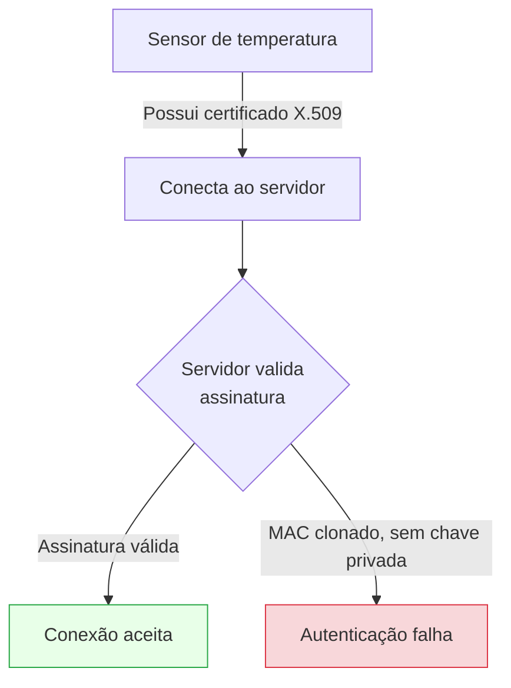
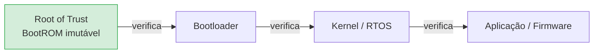
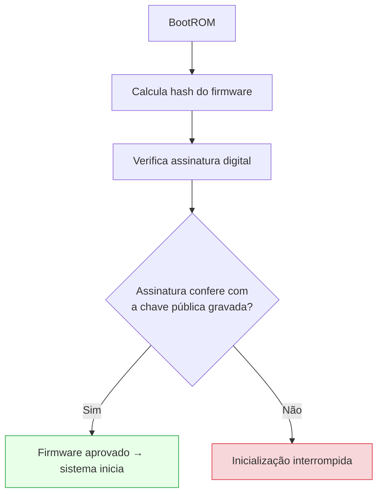
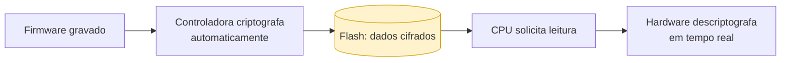
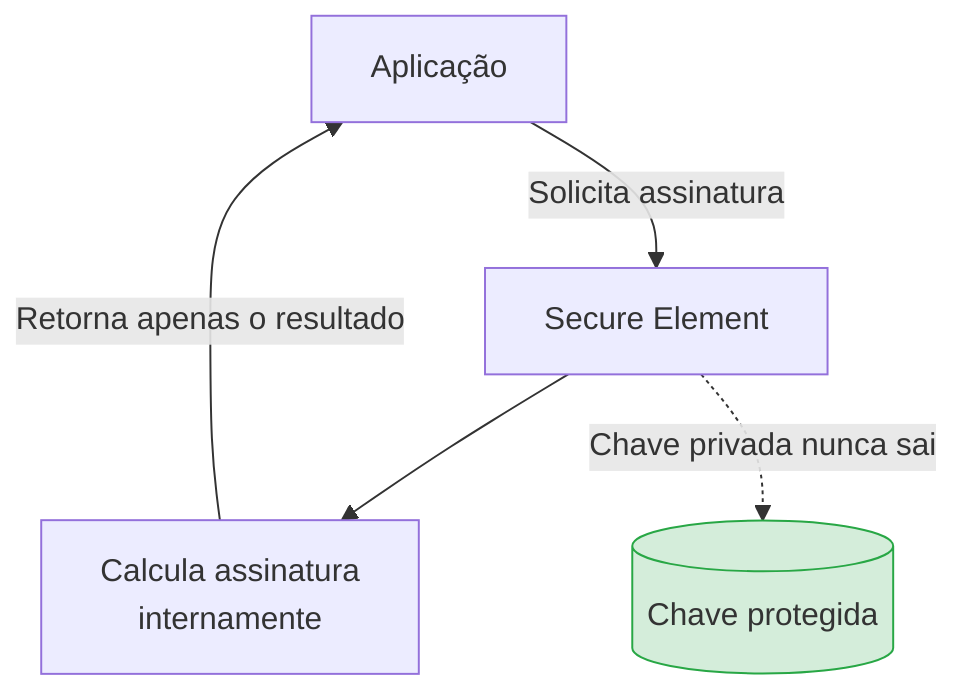
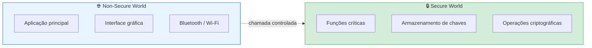
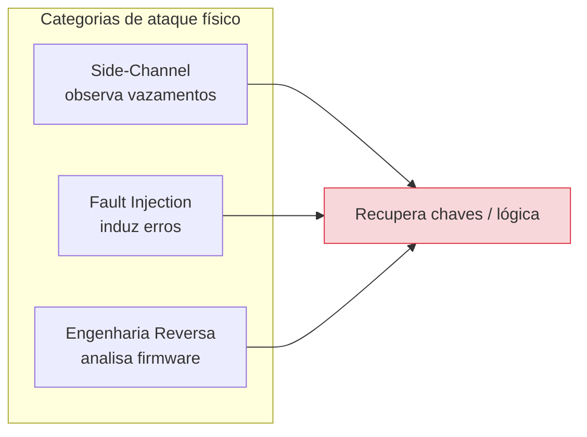
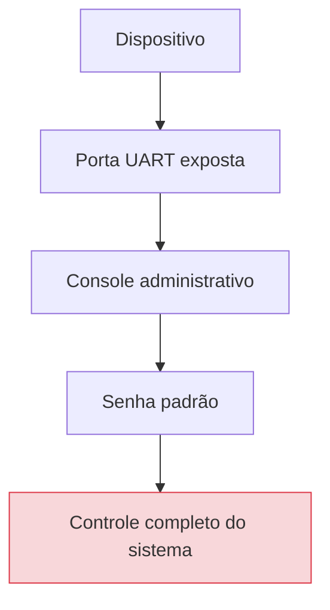
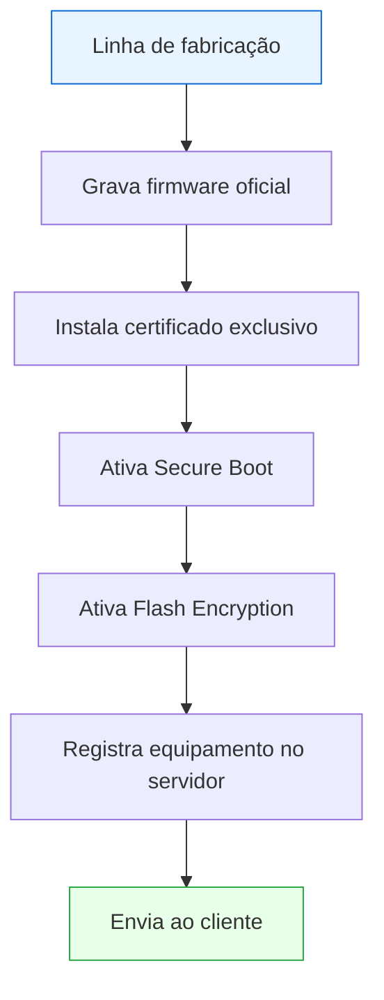

# Volume II — Hardware Seguro, Identidade Digital e Raiz de Confiança

---

## 1. Introdução

Quando pensamos em segurança da informação, é comum imaginar firewalls, antivírus ou criptografia aplicada em servidores. Entretanto, em dispositivos IoT, a segurança começa muito antes do software entrar em execução. **Ela nasce no próprio hardware.**

Em outras palavras, se o hardware não oferecer mecanismos mínimos de proteção, qualquer solução implementada posteriormente poderá ser contornada por um atacante com acesso físico ao dispositivo. Isso ocorre porque o firmware, as chaves criptográficas e até mesmo o processo de inicialização dependem da confiança estabelecida pelo silício do microcontrolador.

É justamente desse conceito que surge o termo **Hardware Root of Trust (Raiz de Confiança em Hardware)**. A ideia é simples:

> Todo sistema precisa confiar em algum componente. Esse componente deve ser extremamente pequeno, imutável e resistente à adulteração. A partir dele, toda a cadeia de segurança é construída.

---

## Objetivos deste volume

Ao concluir este capítulo o estudante deverá compreender:

- como dispositivos IoT constroem sua identidade digital;
- o conceito de Root of Trust;
- Secure Boot;
- Flash Encryption;
- Secure Elements;
- TPM;
- ARM TrustZone;
- eFuses;
- ataques físicos (side-channel, fault injection);
- engenharia reversa de firmware.

---

## 2. A importância da identidade digital

Imagine uma empresa que possui dez mil sensores espalhados por uma cidade. Como o servidor consegue saber se os dados realmente vieram daquele sensor?

Não basta confiar no endereço IP. Nem no endereço MAC. Muito menos em um número de série gravado na etiqueta. **Todos esses dados podem ser copiados.**

Portanto, cada dispositivo precisa possuir uma identidade única. Assim como pessoas possuem CPF ou passaporte, dispositivos modernos possuem **certificados digitais**, que permitem provar matematicamente quem é o equipamento.

Caso um invasor tente criar um sensor falso utilizando o mesmo endereço MAC, a autenticação falhará, pois ele não possui a **chave privada** correspondente ao certificado.

> **💡 Curiosidade — Factory Provisioning:** Atualmente, grandes fabricantes realizam a gravação dessa identidade ainda durante a fabricação do chip. Esse processo é chamado de *Factory Provisioning* e é aprofundado no Volume VII.

---

## 3. Root of Trust (Raiz de Confiança)

Toda arquitetura segura necessita de um ponto inicial de confiança, denominado **Root of Trust**. Ele consiste em um pequeno conjunto de componentes considerados confiáveis por definição. Normalmente inclui:

- BootROM (código imutável de inicialização);
- chaves públicas de referência;
- registradores protegidos;
- aceleradores criptográficos;
- mecanismos de inicialização segura.

Caso esse componente seja comprometido, toda a cadeia de segurança deixa de existir. Por isso sua implementação normalmente ocorre em **hardware**.

> **🏛️ Analogia — o cartório.** Todos os documentos emitidos dependem da autenticidade do cartório. Caso o cartório seja fraudado, nenhum documento poderá ser considerado confiável. O mesmo ocorre em um dispositivo IoT: toda confiança depende da Root of Trust.

### Cadeia de confiança (Chain of Trust)

A partir da raiz, cada estágio verifica o próximo antes de executá-lo, formando uma **cadeia de confiança**:

Se qualquer elo falhar na verificação, a inicialização é interrompida.

---

## 4. Secure Boot

Secure Boot é um mecanismo responsável por impedir que um firmware adulterado seja executado. Durante a inicialização, ocorre uma sequência semelhante à seguinte:

### Por que isso é importante?

Sem Secure Boot, um atacante poderia substituir completamente o firmware. Mesmo que o restante do sistema utilizasse criptografia forte, todo o software estaria comprometido.

### Ataque clássico que o Secure Boot elimina

1. O invasor obtém acesso físico.
2. Regrava a memória Flash.
3. Instala firmware malicioso.
4. O equipamento continua funcionando aparentemente normal.
5. Dados passam a ser enviados ao atacante.

> **⚠️ Atenção:** Secure Boot **não** impede vulnerabilidades no firmware. Ele apenas garante que o firmware executado seja *legítimo*. Se o firmware oficial possuir falhas, elas continuarão existindo.

---

## 5. Flash Encryption

Outro mecanismo importante é a **criptografia da memória Flash**. Em dispositivos antigos, bastava remover o chip de memória para copiar o firmware, encontrar senhas, localizar chaves privadas ou estudar protocolos proprietários.

Atualmente, diversos microcontroladores utilizam Flash Encryption: toda informação armazenada permanece cifrada e, quando o processador realiza uma leitura, a descriptografia ocorre automaticamente pelo hardware — o software sequer percebe esse processo.

**Vantagens:** dificulta engenharia reversa, protege segredos criptográficos, impede clonagem do firmware e reduz risco de vazamento de propriedade intelectual.

---

## 6. eFuses

As **eFuses** são pequenos registradores permanentes existentes em diversos microcontroladores. Após serem programadas, normalmente **não podem ser alteradas** — comportamento semelhante a um "fusível eletrônico": uma vez queimado, não existe retorno.

São utilizadas para armazenar:

- chaves criptográficas;
- identificadores únicos;
- configurações de segurança;
- desativação de interfaces de depuração;
- ativação do Secure Boot.

> **💡 Curiosidade:** O ESP32 utiliza eFuses para armazenar informações críticas relacionadas ao Secure Boot e à Flash Encryption. Caso essas configurações sejam definidas incorretamente, o próprio dispositivo pode tornar-se inutilizável (*bricked*).

---

## 7. Secure Element

Muitos dispositivos utilizam um componente dedicado exclusivamente à segurança, chamado **Secure Element (SE)**. Ao contrário da memória comum, ele foi projetado para resistir a ataques físicos. Suas principais funções incluem:

- armazenamento de certificados;
- geração de números aleatórios (TRNG);
- assinatura digital;
- armazenamento de chaves privadas.

O ponto central: **o software nunca acessa diretamente essas chaves** — ele apenas solicita operações criptográficas.

**Exemplos comerciais:** Microchip ATECC608, Infineon OPTIGA Trust, NXP SE050. Amplamente utilizados em dispositivos industriais.

---

## 8. TPM (Trusted Platform Module)

Embora muito conhecido em computadores, o **TPM** também aparece em dispositivos IoT de maior porte. Seu objetivo é semelhante ao Secure Element, mas oferece recursos adicionais:

- medição da integridade do sistema;
- armazenamento seguro (*sealed storage*);
- geração de certificados;
- suporte a **Remote Attestation** (prova remota de integridade).

É comum em gateways industriais, servidores Edge e equipamentos críticos.

| Característica | Secure Element | TPM |
| ---------------- | ---------------- | ----- |
| Foco | Armazenar chaves e assinar | Medir e atestar integridade da plataforma |
| Padronização | Varia por fabricante | Especificação TCG (padrão aberto) |
| Uso típico | Sensores, dispositivos pequenos | Gateways, PCs, servidores Edge |
| Remote Attestation | Limitado | Nativo |

---

## 9. ARM TrustZone

Os processadores ARM modernos introduziram uma tecnologia denominada **TrustZone**, que divide o sistema em dois "mundos" independentes, isolados por hardware.

Caso um invasor comprometa a aplicação principal, ele permanece **restrito ao ambiente não seguro**. As chaves criptográficas continuam inacessíveis. Grande parte dos microcontroladores modernos usados em produtos profissionais já incorpora TrustZone ou tecnologias equivalentes.

---

## 10. Ataques físicos

Diferentemente de um servidor instalado em um datacenter, dispositivos IoT frequentemente permanecem expostos. Isso permite ataques impossíveis em ambientes convencionais.

### Side-Channel Attacks (canal lateral)

Em vez de atacar o algoritmo criptográfico, o atacante observa **características físicas** que vazam informação:

- consumo de energia (*power analysis*);
- emissão eletromagnética;
- tempo de execução;
- temperatura.

Essas informações podem revelar partes de uma chave criptográfica.

### Fault Injection (injeção de falhas)

Consiste em provocar erros intencionalmente para desviar a execução:

- queda de tensão (*voltage glitching*);
- aumento da frequência do clock;
- pulsos eletromagnéticos;
- lasers.

O objetivo é fazer o processador **pular uma verificação** (por exemplo, a checagem de assinatura do Secure Boot).

### Engenharia reversa

Após extrair o firmware, o atacante utiliza ferramentas como **Ghidra**, **IDA Pro**, **Binwalk** e **Firmware Mod Kit** para compreender o funcionamento interno do dispositivo.

---

## 11. Interfaces de depuração

Durante o desenvolvimento, engenheiros utilizam interfaces especiais como **UART**, **JTAG** e **SWD**, que permitem pausar a CPU, modificar registradores, ler memória e atualizar firmware.

Caso permaneçam habilitadas em produção, tornam-se uma grave vulnerabilidade.

Esse tipo de falha ainda é encontrado em diversos equipamentos comerciais.

> **⚠️ Atenção:** Desabilitar (via eFuse) ou remover fisicamente essas interfaces em produção é considerado boa prática de engenharia.

---

## 12. Provisionamento seguro

Provisionar um dispositivo significa prepará-lo para entrar em operação. Nessa etapa normalmente ocorre:

Esse processo deve ocorrer em ambiente controlado. Caso seja comprometido, **todos os dispositivos produzidos poderão nascer inseguros**.

> **💡 Curiosidade — HSM:** Grandes fabricantes automatizam completamente esse processo utilizando **Hardware Security Modules (HSMs)** para impedir que funcionários tenham acesso às chaves privadas da empresa.

---

## Resumo do Volume

Neste capítulo estudamos os mecanismos fundamentais que permitem estabelecer confiança em dispositivos IoT desde o hardware. Foram apresentados conceitos como identidade digital, Root of Trust, cadeia de confiança, Secure Boot, Flash Encryption, Secure Elements, TPMs, TrustZone, eFuses e interfaces de depuração.

Também foram discutidos ataques físicos (side-channel, fault injection) e técnicas de engenharia reversa, demonstrando que a segurança em IoT depende tanto de software quanto das características do próprio silício.

Esses mecanismos constituem a base sobre a qual protocolos seguros, autenticação mútua e criptografia poderão operar de forma confiável.

---

## Perguntas para discussão

1. É possível construir um dispositivo realmente seguro utilizando apenas software?
2. Qual a vantagem de utilizar um Secure Element em vez de armazenar chaves diretamente na Flash?
3. Um firmware assinado digitalmente pode conter vulnerabilidades?
4. Vale a pena adicionar mecanismos de segurança em dispositivos extremamente baratos?
5. Como equilibrar custo de produção e segurança?

---

## Possíveis perguntas do professor

- **Por que Secure Boot não substitui um antivírus?**
- **Qual a diferença entre TPM e Secure Element?**
- **Por que eFuses são irreversíveis?**
- **Como a Flash Encryption dificulta a engenharia reversa?**
- **Qual o papel do TrustZone em arquiteturas ARM modernas?**
- **Por que uma interface UART esquecida pode comprometer completamente um dispositivo?**

---

## Leituras recomendadas

- Ross Anderson — *Security Engineering*
- *Practical IoT Hacking* (No Starch Press)
- ARM TrustZone Technology — Documentação oficial ARM
- Microchip ATECC608 — Datasheet
- NIST SP 800-193 — *Platform Firmware Resiliency Guidelines*
- Trusted Computing Group (TCG) — TPM 2.0 Library Specification
- *IEEE Internet of Things Journal*

---

**Continua no Volume III — Protocolos, Criptografia e Comunicação Segura.**
