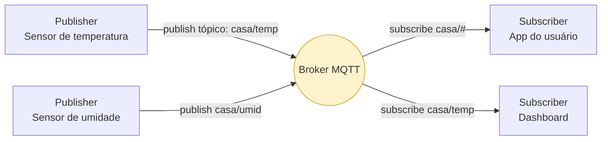
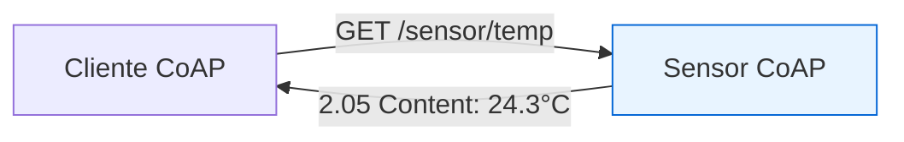
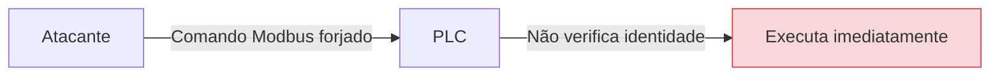
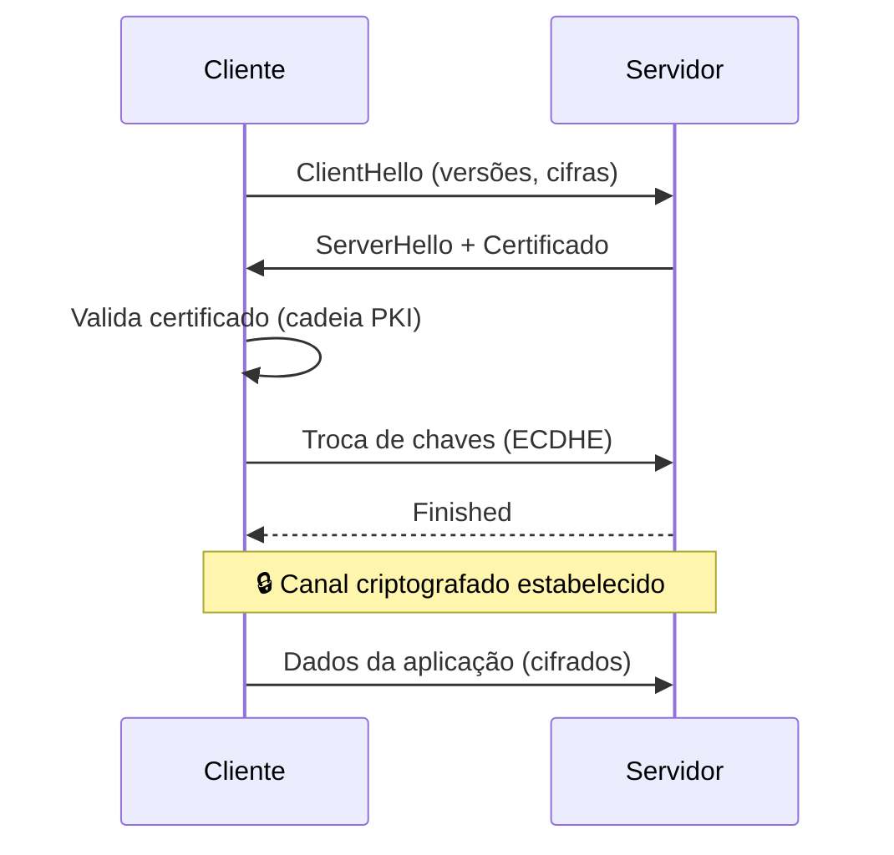
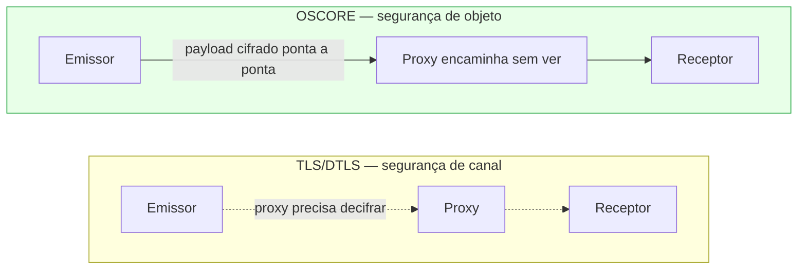
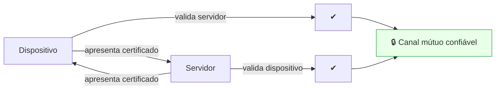
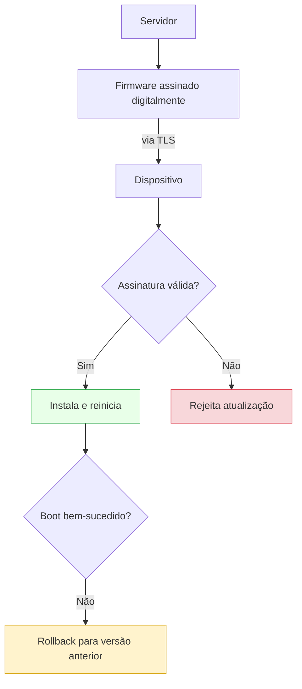

# Volume III — Protocolos, Criptografia e Comunicação Segura

---

## 1. Introdução

Após compreender como o hardware estabelece uma identidade confiável e protege informações sensíveis, surge um novo desafio: **como transmitir dados entre dispositivos sem que eles sejam interceptados, alterados ou falsificados?**

Em um ecossistema IoT, sensores, atuadores, gateways, servidores e aplicações trocam milhares — ou até milhões — de mensagens diariamente. Essas comunicações podem ocorrer por diferentes meios, como Wi-Fi, Ethernet, Bluetooth Low Energy (BLE), ZigBee, LoRaWAN ou redes celulares (NB-IoT e LTE-M).

Independentemente da tecnologia empregada, três requisitos fundamentais devem ser atendidos (a **tríade CIA**):

- **Confidencialidade:** impedir que terceiros leiam os dados transmitidos;
- **Integridade:** garantir que a informação não seja modificada durante o percurso;
- **Autenticidade:** assegurar que remetente e destinatário sejam realmente quem afirmam ser.

Sem esses mecanismos, um invasor poderia capturar comandos destinados a uma fechadura inteligente, modificar leituras de sensores ambientais ou assumir o controle de dispositivos críticos.

---

## Objetivos deste volume

Ao final deste capítulo o estudante deverá compreender:

- por que IoT utiliza protocolos específicos;
- funcionamento do MQTT e do CoAP;
- diferenças entre HTTP e MQTT;
- importância do TLS e DTLS;
- autenticação baseada em certificados;
- gerenciamento de certificados digitais (PKI);
- autenticação mútua (mTLS);
- atualizações OTA seguras;
- principais vulnerabilidades associadas aos protocolos de comunicação.

---

## 2. Comunicação em IoT

Ao contrário da computação tradicional, muitos dispositivos IoT possuem limitações severas de processamento, memória e energia, o que inviabiliza protocolos excessivamente complexos. Por esse motivo surgiram protocolos especializados: **MQTT, CoAP, DDS, OPC UA e AMQP**.

### Panorama comparativo

| Protocolo | Transporte | Modelo | Segurança típica | Cenário ideal |
| ----------- | ----------- | -------- | ------------------ | ---------------- |
| **MQTT** | TCP | Publish/Subscribe | TLS | Telemetria, banda instável |
| **CoAP** | UDP | REST (request/response) | DTLS / OSCORE | Dispositivos muito restritos |
| **HTTP/REST** | TCP | Request/Response | TLS | Integração com web/APIs |
| **AMQP** | TCP | Filas/mensageria | TLS | Sistemas corporativos |
| **DDS** | UDP/TCP | Data-centric pub/sub | DDS Security | Tempo real, robótica, defesa |
| **OPC UA** | TCP | Cliente/servidor + pub/sub | Nativa (perfis) | Indústria 4.0 (IIoT) |

> **Exemplo:** um sensor de temperatura alimentado por bateria que enviasse centenas de cabeçalhos HTTP diariamente desperdiçaria energia. Protocolos leves tornam-se muito mais eficientes nesse cenário.

---

## 3. MQTT (Message Queuing Telemetry Transport)

O MQTT é atualmente um dos protocolos mais utilizados em IoT. Foi criado para ambientes com baixa largura de banda, conexões instáveis e dispositivos com poucos recursos. Seu funcionamento baseia-se no modelo **Publish/Subscribe**: os dispositivos não enviam mensagens diretamente uns aos outros, mas publicam informações em um intermediário denominado **Broker**.

### Conceitos principais

- **Publisher:** envia mensagens (ex.: sensor de temperatura).
- **Subscriber:** recebe mensagens publicadas (ex.: aplicativo do usuário).
- **Broker:** servidor que intermedia toda a comunicação. Exemplos: Mosquitto, HiveMQ, EMQX, AWS IoT Core, Azure IoT Hub.
- **Tópico (Topic):** endereço hierárquico da mensagem (ex.: `casa/sala/temperatura`).

### QoS (Quality of Service)

| Nível | Garantia | Vantagem | Custo |
| ------- | ---------- | ---------- | ------- |
| **QoS 0** | No máximo uma vez ("fire and forget") | Mais rápido, menor consumo | Pode perder mensagens |
| **QoS 1** | Pelo menos uma vez | Entrega garantida | Pode duplicar |
| **QoS 2** | Exatamente uma vez | Máxima confiabilidade | Maior latência e banda |

**Vantagens:** protocolo extremamente leve, baixo consumo energético, excelente escalabilidade e implementação simples.

> **⚠️ Atenção — mito comum:** um erro frequente é afirmar que "MQTT é seguro". Na realidade, o MQTT apenas define **como** as mensagens são transportadas; ele **não oferece criptografia nem autenticação forte nativamente**. A segurança depende de mecanismos adicionais: **TLS**, autenticação (usuário/senha ou certificados) e controle de acesso por tópico (ACLs).

---

## 4. CoAP (Constrained Application Protocol)

O CoAP (**RFC 7252**) foi desenvolvido especificamente para dispositivos extremamente limitados. Seu funcionamento lembra o HTTP (usa métodos GET, POST, PUT, DELETE), porém utiliza **UDP** em vez de TCP, reduzindo consumo energético, latência e quantidade de mensagens.

**Segurança:** como utiliza UDP, o CoAP normalmente emprega **DTLS (Datagram TLS)**. Em cenários muito restritos, pode utilizar **OSCORE**, que protege apenas o conteúdo da mensagem, mantendo parte do cabeçalho visível para facilitar o roteamento.

> **💡 Curiosidade:** Diversos projetos de cidades inteligentes utilizam CoAP devido ao seu baixo consumo de energia e ao bom desempenho em redes com muitos nós.

---

## 5. OPC UA

Embora menos comum em IoT residencial, o **OPC UA** tornou-se um dos principais protocolos da IIoT. Foi desenvolvido para substituir protocolos industriais inseguros e suporta autenticação, criptografia, assinatura digital, controle de acesso e comunicação entre diferentes fabricantes (interoperabilidade). Atualmente é considerado um dos pilares da **Indústria 4.0**.

---

## 6. Protocolos industriais legados

Muitos equipamentos antigos utilizam protocolos criados décadas atrás, como **Modbus, DNP3, PROFIBUS e BACnet**. Esses protocolos priorizavam disponibilidade e **não possuem autenticação, criptografia ou verificação de integridade**.

Esse cenário demonstra por que protocolos legados precisam ser **encapsulados** em conexões seguras (VPN, TLS) e isolados por segmentação (ver Volume IV).

---

## 7. TLS (Transport Layer Security)

O TLS é atualmente o principal mecanismo para proteger comunicações sobre TCP. Sua função é estabelecer um canal seguro por meio de um *handshake*.

**O que o TLS garante:** confidencialidade, integridade, autenticação e proteção contra ataques *Man-in-the-Middle*.

### TLS 1.3 (RFC 8446)

A versão mais recente reduziu significativamente o tempo de conexão, o número de mensagens do handshake (1-RTT, ou 0-RTT em retomadas) e removeu algoritmos inseguros. Por isso tornou-se **altamente recomendada** para aplicações IoT modernas.

---

## 8. DTLS

Quando a comunicação ocorre via **UDP**, utiliza-se **DTLS**, que fornece garantias semelhantes ao TLS, mas foi adaptado para lidar com perda e reordenação de pacotes. É amplamente utilizado em CoAP, sensores ambientais e dispositivos alimentados por bateria.

---

## 9. OSCORE

**OSCORE** (*Object Security for Constrained RESTful Environments* — RFC 8613) protege diretamente o **conteúdo** da mensagem (segurança na camada de aplicação), e não apenas o canal. Isso permite que proxies e roteadores continuem encaminhando pacotes sem necessidade de descriptografá-los — especialmente útil em redes extremamente limitadas.

---

## 10. PKI (Public Key Infrastructure)

Toda autenticação baseada em certificados depende de uma infraestrutura denominada **PKI**, composta por: Autoridade Certificadora (CA), certificados digitais, chaves públicas, chaves privadas e listas de revogação (CRL/OCSP).

> **🏛️ Analogia:** a Autoridade Certificadora funciona como um cartório: garante que determinado certificado pertence realmente ao dispositivo.

### Certificados X.509

Os certificados normalmente armazenam: identidade do dispositivo, chave pública, período de validade e a assinatura da autoridade certificadora. Quando um dispositivo conecta-se ao servidor, esse certificado é apresentado e validado antes de qualquer comunicação.

---

## 11. Autenticação Mútua (mTLS)

Na navegação comum da Internet, apenas o **servidor** apresenta certificado. Na IoT isso normalmente não é suficiente. Em ambientes industriais utiliza-se **Mutual TLS (mTLS)**, no qual **ambos** os lados provam sua identidade.

Essa abordagem reduz significativamente ataques de falsificação (spoofing).

---

## 12. Atualizações OTA (Over-The-Air)

Manter dispositivos atualizados é essencial, mas atualizar firmware pela Internet também representa um risco: se um atacante substituir o arquivo de atualização, poderá instalar código malicioso. Por isso, atualizações OTA modernas utilizam **assinatura digital, verificação criptográfica, Secure Boot, rollback protegido e canais criptografados**.

> **💡 Curiosidade — A/B partitions:** Alguns fabricantes mantêm **duas partições de firmware**. Caso a atualização falhe, o dispositivo retorna automaticamente à versão anterior, evitando *bricking*.

---

## 13. Vulnerabilidades comuns

Mesmo utilizando protocolos modernos, diversos erros continuam sendo encontrados:

- certificados expirados;
- senhas padrão;
- autenticação desabilitada;
- TLS mal configurado (cifras fracas, versões obsoletas como SSLv3/TLS 1.0);
- uso de algoritmos criptográficos obsoletos (MD5, SHA-1, RC4, DES);
- **ausência de validação do certificado do servidor**.

Esses problemas frequentemente decorrem de *implementações inadequadas*, e não dos protocolos em si.

> **🔍 Na prática:** Diversas câmeras IP antigas aceitam conexões HTTPS, mas **não verificam corretamente o certificado** apresentado pelo servidor. Isso abre caminho para ataques *Man-in-the-Middle*, permitindo que um adversário intercepte credenciais e vídeo.

---

## Resumo do Volume

Neste capítulo foram apresentados os principais protocolos utilizados na comunicação entre dispositivos IoT. Estudamos MQTT, CoAP, OPC UA, TLS, DTLS, OSCORE e os conceitos fundamentais de PKI, certificados digitais e autenticação mútua.

Também discutimos os desafios relacionados às atualizações OTA e as vulnerabilidades frequentemente encontradas em implementações reais. Esses mecanismos garantem que as informações trafeguem de forma segura entre dispositivos, gateways e serviços em nuvem — um dos pilares da segurança em sistemas IoT modernos.

---

## Perguntas para discussão

1. MQTT deveria oferecer criptografia nativamente?
2. Em quais situações CoAP é mais adequado que MQTT?
3. Um certificado digital expirado representa um risco de segurança?
4. Por que atualizações OTA precisam ser assinadas digitalmente?
5. É possível confiar apenas em senhas para autenticar dispositivos IoT?

---

## Possíveis perguntas do professor

- **Qual a principal diferença entre MQTT e HTTP?**
- **Por que o MQTT depende de TLS para garantir confidencialidade?**
- **Quando utilizar DTLS em vez de TLS?**
- **Qual a vantagem do Mutual TLS em dispositivos IoT?**
- **Como um certificado digital impede ataques de spoofing?**
- **Por que atualizações OTA inseguras representam uma ameaça tão grave?**

---

## Leituras recomendadas

- OASIS — *MQTT Version 5.0 Specification*
- RFC 8446 — *TLS 1.3*
- RFC 7252 — *CoAP*
- RFC 8613 — *OSCORE*
- RFC 9147 — *DTLS 1.3*
- OPC Foundation — *OPC UA Specifications*
- NIST SP 800-52 Rev. 2 — *Guidelines for TLS Implementations*

---

## Encerramento da Parte I

Ao longo dos três primeiros volumes foram apresentados os fundamentos que sustentam a segurança em dispositivos IoT:

- a evolução da Internet das Coisas e seus desafios;
- os mecanismos de segurança implementados diretamente no hardware, como Root of Trust, Secure Boot e Flash Encryption;
- os principais protocolos de comunicação e as tecnologias criptográficas responsáveis por proteger os dados durante sua transmissão.

Esses conhecimentos formam a base necessária para compreender, na próxima parte, como essas tecnologias são aplicadas em ambientes industriais, quais ataques reais exploram suas vulnerabilidades e quais estratégias podem ser adotadas para proteger infraestruturas críticas e dispositivos conectados.

**Continua na Parte II — Volume IV: Segurança Industrial (IIoT), Arquitetura Purdue e Segmentação de Redes.**
