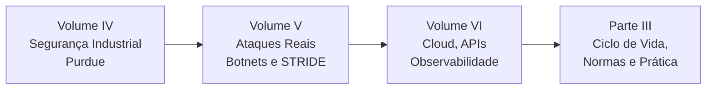
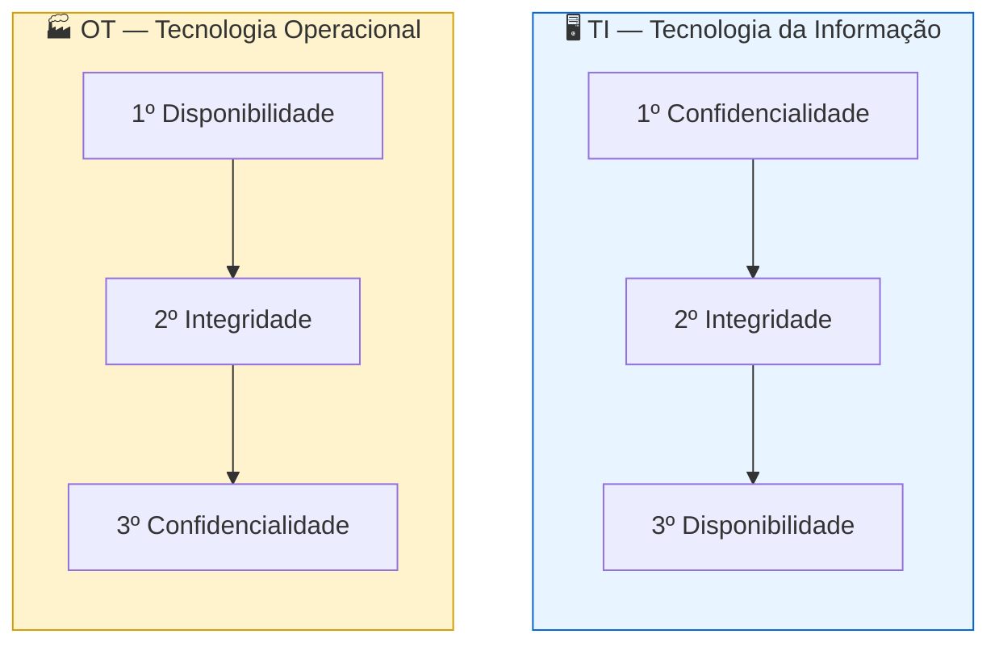
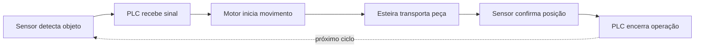
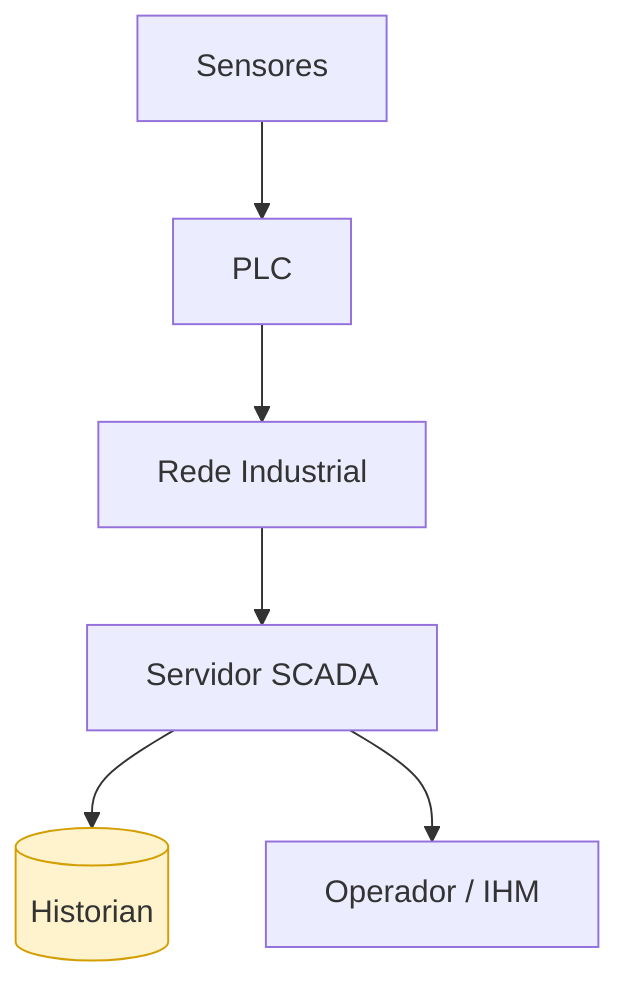
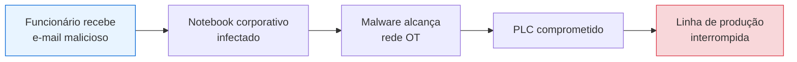
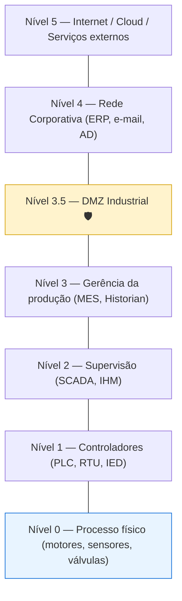
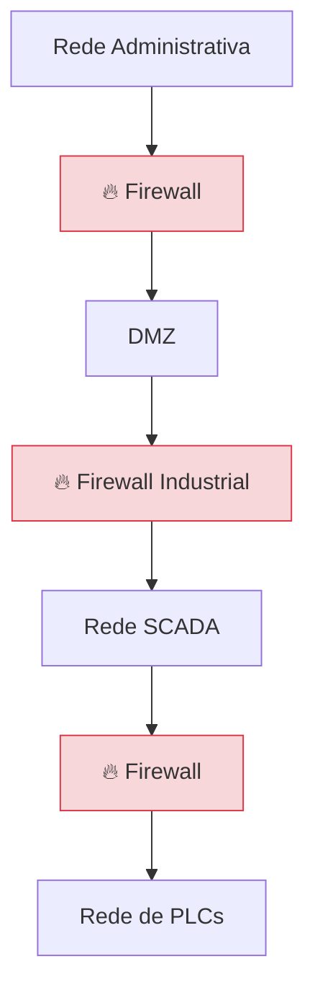
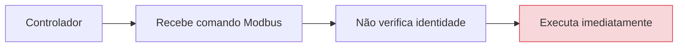
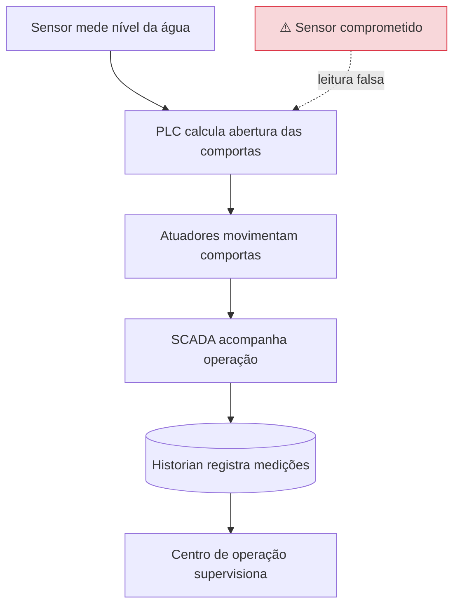

# Parte II

## Volume IV — Segurança Industrial (IIoT), Arquitetura Purdue e Segmentação de Redes

---

## Mapa da Parte II

---

## 1. Introdução

Até este momento, os capítulos abordaram a segurança aplicada principalmente aos dispositivos IoT convencionais, como câmeras IP, sensores ambientais e dispositivos residenciais.

Entretanto, existe um ramo da Internet das Coisas onde uma falha de segurança pode gerar impactos muito maiores: a **Industrial Internet of Things (IIoT)**. Nela, sensores e atuadores controlam processos físicos essenciais para a sociedade:

- usinas hidrelétricas;
- refinarias;
- linhas de produção;
- hospitais;
- sistemas ferroviários;
- aeroportos;
- redes elétricas;
- tratamento de água;
- plataformas de petróleo.

Nesses ambientes, o objetivo da segurança deixa de ser apenas proteger dados e passa a proteger **pessoas, patrimônio, meio ambiente e continuidade operacional**. Por esse motivo, diversas arquiteturas específicas foram desenvolvidas para separar sistemas críticos das redes corporativas e da Internet.

---

## Objetivos deste volume

Ao final deste capítulo o estudante deverá compreender:

- diferenças entre TI e OT;
- conceitos de ICS (SCADA, PLC, RTU, DCS, IED);
- funcionamento de sistemas SCADA;
- arquitetura Purdue;
- segmentação de redes industriais (zonas e conduítes);
- protocolos industriais;
- a importância da disponibilidade em ambientes críticos.

---

## 2. TI versus OT

Um dos conceitos mais importantes da IIoT é compreender que **Tecnologia da Informação (TI)** e **Tecnologia Operacional (OT)** possuem objetivos diferentes — e, notavelmente, **prioridades invertidas na tríade CIA**.

| Aspecto | TI | OT |
| --------- | ----- | ----- |
| Prioridade máxima | Confidencialidade | Disponibilidade |
| Exemplos | ERP, e-mail, bancos de dados | Motores, bombas, turbinas, válvulas |
| Vida útil típica | 3–5 anos | 20–30 anos |
| Atualização | Frequente, automática | Rara, planejada (janelas de parada) |
| Reinicialização | Aceitável | Pode causar acidente |

> **Exemplo:** perder acesso a um servidor de e-mail por alguns minutos gera atraso. Perder comunicação com o sistema que controla a pressão de uma caldeira pode resultar em acidente grave.
> **💡 Curiosidade:** Muitos equipamentos industriais permanecem em funcionamento por 20 ou 30 anos. Ainda existem dispositivos usando sistemas operacionais e protocolos desenvolvidos décadas atrás.

---

## 3. O que são ICS?

**ICS** (*Industrial Control Systems*) engloba os sistemas responsáveis pelo controle de processos industriais.

| Componente | Nome | Função |
| ----------- | ------ | -------- |
| **PLC** | Programmable Logic Controller (CLP) | Executa lógica de controle em tempo real |
| **RTU** | Remote Terminal Unit | Coleta dados de ativos distribuídos geograficamente |
| **DCS** | Distributed Control System | Controle distribuído em grandes plantas |
| **IED** | Intelligent Electronic Device | Relés e medidores inteligentes (setor elétrico) |
| **SCADA** | Supervisory Control And Data Acquisition | Supervisão e aquisição de dados |

### PLC (Programmable Logic Controller)

É um computador industrial extremamente robusto cuja função é executar lógica de controle. O ciclo pode ocorrer milhares de vezes por hora:

### RTU, DCS e IED

- **RTU:** utilizada quando os equipamentos estão distribuídos geograficamente (subestações, oleodutos, estações meteorológicas, irrigação).
- **DCS:** muito usado em refinarias e indústrias químicas; diversos controladores trabalham de forma distribuída, aumentando disponibilidade, redundância e escalabilidade.
- **IED:** equipamentos inteligentes do setor elétrico (relés digitais, medidores inteligentes, controladores de proteção).

---

## 4. O que é SCADA?

**SCADA** (*Supervisory Control And Data Acquisition*) supervisiona processos, armazena históricos, emite alarmes e controla equipamentos remotamente.

### Historian

O **Historian** é um banco de dados especializado em **séries temporais**, que armazena continuamente temperatura, pressão, corrente, tensão, vazão e velocidade. Esses dados permitem identificar falhas, gerar gráficos, prever manutenção e realizar auditorias.

> **🔍 Na prática:** Plataformas SCADA comuns incluem Ignition, Siemens WinCC, Elipse E3, FactoryTalk e AVEVA.

---

## 5. A convergência entre TI e OT

Durante décadas, redes industriais permaneceram completamente isoladas — conceito conhecido como **Air Gap**. A premissa: se a rede não está conectada à Internet, ela é naturalmente segura.

A **Indústria 4.0** modificou esse cenário. Hoje, gestores desejam visualizar indicadores de produção no smartphone, o que exige integração entre rede industrial, rede corporativa, nuvem e aplicativos. Embora útil, essa integração cria novos caminhos para ataques.

> **⚠️ Nota:** O ataque **Stuxnet** (2010) demonstrou que nem mesmo o *air gap* é garantia absoluta — a propagação ocorreu via pendrives USB (ver Volume V).

---

## 6. Arquitetura Purdue

Para reduzir esses riscos surgiu o **Modelo Purdue** (Purdue Enterprise Reference Architecture — PERA), que organiza a infraestrutura industrial em níveis hierárquicos.

| Nível | Descrição | Exemplos |
| ------- | ----------- | ---------- |
| **0** | Processo físico | Motores, sensores, válvulas, atuadores |
| **1** | Controle básico | PLC, RTU, IED |
| **2** | Supervisão de área | SCADA, IHM, estações de operação |
| **3** | Operações de manufatura | MES, servidores industriais, Historian |
| **3.5** | **DMZ Industrial** | Camada de isolamento entre OT e TI |
| **4** | Rede corporativa | ERP, e-mail, Active Directory |
| **5** | Enterprise / Internet | Cloud, serviços externos |

### Importância da DMZ Industrial

A DMZ atua como zona de isolamento: impede que um invasor acesse diretamente um PLC a partir da Internet. Todo acesso deve passar por autenticação, inspeção e controle adicionais.

> **⚠️ Atenção:** Uma boa arquitetura **nunca** permite comunicação direta entre um PLC e a Internet pública.

---

## 7. Segmentação de Redes

Um princípio fundamental da segurança industrial é a **segmentação**: nem todos os dispositivos devem conversar entre si. A rede é dividida em pequenas **zonas**, e a comunicação entre elas passa por **conduítes** controlados (terminologia da ISA/IEC 62443).

Caso um computador seja comprometido, o atacante encontrará **diversas barreiras** antes de alcançar os controladores — princípio de **Defense in Depth**.

### Firewalls industriais

Semelhantes aos tradicionais, mas **compreendem protocolos industriais** (Modbus, DNP3, EtherNet/IP, PROFINET). Isso permite identificar comandos potencialmente perigosos — por exemplo, uma tentativa de escrita em registradores Modbus — e bloqueá-los automaticamente (*Deep Packet Inspection* industrial).

---

## 8. Protocolos Industriais

Grande parte da infraestrutura ainda utiliza protocolos antigos: **Modbus, DNP3, PROFIBUS, EtherNet/IP e HART**. Muitos foram desenvolvidos quando praticamente não existiam ameaças cibernéticas e, por isso, **não possuem autenticação, criptografia ou verificação de integridade**.

Essa característica representa um dos maiores desafios da cibersegurança industrial.

---

## 9. ISA/IEC 62443

A série **ISA/IEC 62443** é considerada a principal norma internacional para segurança de sistemas industriais. Estabelece diretrizes para fabricantes, integradores, operadores e desenvolvedores.

Entre seus princípios destacam-se:

- **Defense in Depth** (defesa em profundidade);
- segmentação (zonas e conduítes);
- autenticação;
- gerenciamento de riscos;
- atualização segura;
- monitoramento contínuo.

A norma também define **Security Levels (SL 1–4)**, que graduam a robustez exigida conforme a capacidade do atacante que se deseja resistir (desde violação casual até adversário com recursos de Estado-nação).

---

## 10. Disponibilidade acima de tudo

Na computação tradicional, um servidor pode ser reiniciado de madrugada. Na indústria isso nem sempre é possível: muitos processos funcionam **continuamente** (refinarias, siderúrgicas, hospitais, usinas). Uma interrupção inesperada pode causar prejuízos milionários, danos ambientais e acidentes.

Por isso, atualizações de segurança frequentemente precisam ser **cuidadosamente planejadas** em janelas de manutenção.

### Exemplo Industrial — usina hidrelétrica

Caso um invasor modifique as leituras do sensor, **todas as decisões seguintes** poderão ser comprometidas. Esse exemplo demonstra como um simples dispositivo IoT pode influenciar um sistema inteiro.

---

## Resumo do Volume

Neste capítulo foram apresentados os principais conceitos de segurança em ambientes industriais. Discutimos as diferenças entre TI e OT, os componentes dos sistemas ICS, o funcionamento de arquiteturas SCADA e a importância do Modelo Purdue como estratégia de segmentação.

Também foram abordados os desafios impostos pelos protocolos industriais legados e pelas exigências de disponibilidade contínua presentes em infraestruturas críticas. Esses conceitos constituem a base para compreender os ataques reais estudados no próximo volume.

---

## Perguntas para discussão

1. O modelo Air Gap ainda é suficiente para proteger ambientes industriais?
2. Por que disponibilidade possui prioridade sobre confidencialidade em OT?
3. Vale a pena substituir imediatamente todos os protocolos industriais antigos?
4. Como a segmentação reduz o impacto de um ataque?
5. Quais seriam as consequências da conexão direta entre um PLC e a Internet?

---

## Possíveis perguntas do professor

- **Qual a principal diferença entre TI e OT?**
- **Por que o Modelo Purdue continua sendo amplamente utilizado?**
- **Qual a função da DMZ Industrial?**
- **O que diferencia um firewall industrial de um firewall convencional?**
- **Por que protocolos como Modbus ainda são utilizados mesmo apresentando limitações de segurança?**

---

## Leituras recomendadas

- ISA/IEC 62443 Series
- NIST SP 800-82 Rev. 3 — *Guide to Operational Technology (OT) Security*
- MITRE ATT&CK for ICS
- Ross Anderson — *Security Engineering*

---

**Continua no Volume V — Ataques Reais, Botnets, Vulnerabilidades e Modelagem de Ameaças para Dispositivos IoT.**
