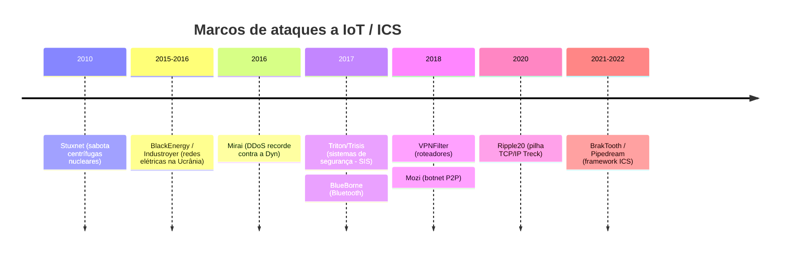
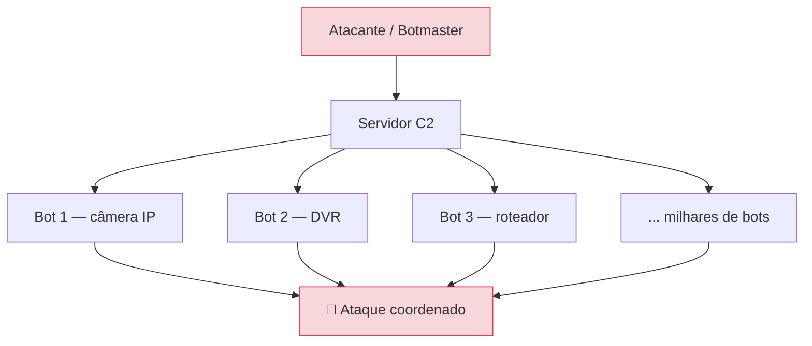
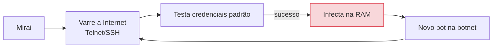
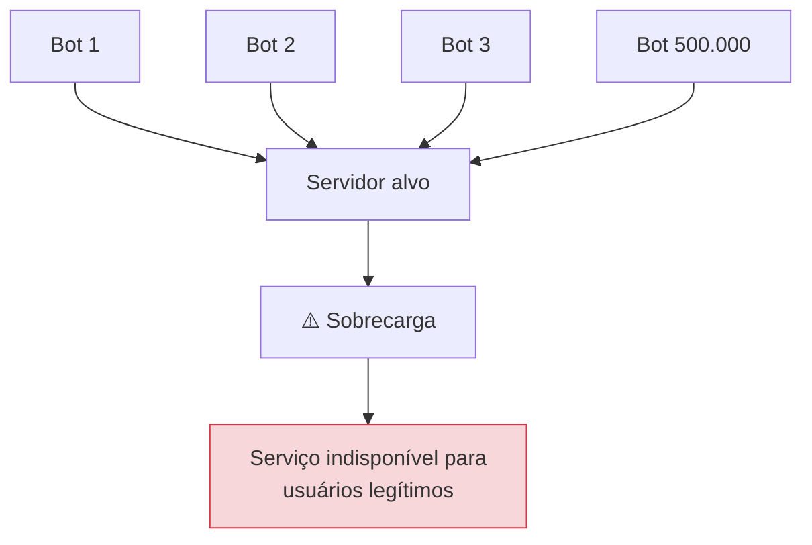
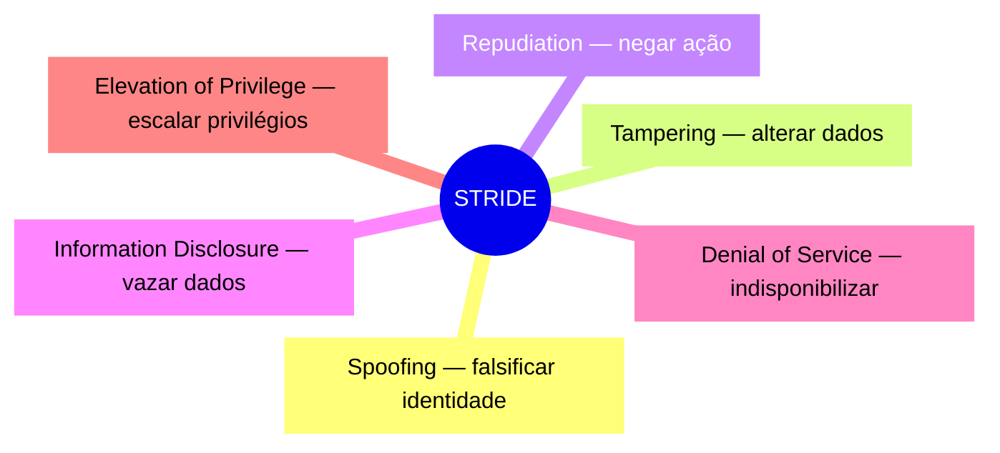
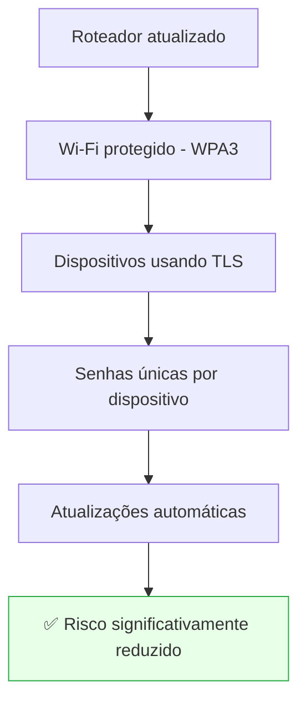

# Volume V — Ataques Reais, Botnets, Vulnerabilidades e Modelagem de Ameaças para Dispositivos IoT

---

## 1. Introdução

Todo sistema conectado à Internet está sujeito a ataques. Entretanto, dispositivos IoT apresentam características que os tornam **especialmente atrativos** para criminosos: permanecem ligados por anos, recebem poucas atualizações, utilizam senhas padrão e executam firmwares desenvolvidos com recursos limitados.

Nos últimos anos, diversos incidentes demonstraram que ataques contra IoT podem provocar impactos globais.

Este capítulo apresenta esses ataques sob uma perspectiva didática: como funcionam, quais vulnerabilidades exploram e quais estratégias os evitam.

---

## Objetivos deste volume

Ao final deste capítulo o estudante deverá compreender:

- o conceito de botnet;
- funcionamento de ataques DDoS utilizando IoT;
- principais vulnerabilidades exploradas por atacantes;
- conceitos de modelagem de ameaças;
- STRIDE;
- OWASP IoT Top 10;
- MITRE ATT&CK for ICS;
- boas práticas de mitigação.

---

## 2. O que é uma Botnet?

Uma **botnet** é um conjunto de dispositivos comprometidos e controlados remotamente por um atacante. Cada equipamento infectado passa a ser um **bot** ou **zumbi** e, embora aparente funcionar normalmente, aguarda comandos de um servidor de **Comando e Controle (C2)**.

Os dispositivos podem executar: ataques DDoS, envio de spam, mineração de criptomoedas, espionagem e propagação para novos dispositivos.

> **💡 Curiosidade:** Muitos proprietários sequer percebem que seus equipamentos foram comprometidos. A câmera continua gravando normalmente enquanto participa de ataques contra outros sistemas.

---

## 3. O Caso Mirai

O **Mirai** tornou-se um dos malwares mais conhecidos da história da IoT. Seu funcionamento era relativamente simples: varria a Internet procurando dispositivos com **Telnet** ou **SSH** expostos e tentava autenticar-se com uma lista de **credenciais padrão** de fábrica (por exemplo, `admin/admin`, `root/root`, `admin/password`). Ao obter sucesso, instalava-se na memória RAM e integrava o dispositivo à botnet.

### O ataque à Dyn

> **📈 Dado verificado:** Em **21–22 de outubro de 2016**, a botnet Mirai lançou ondas sucessivas de DDoS contra a **Dyn**, provedora de DNS gerenciado. Estimativas relatam pico próximo de **~1,2 Tbps**, originado de **dezenas de milhões de endereços IP**. O ataque tornou temporariamente inacessíveis serviços como **Twitter, Netflix, Reddit, Spotify, GitHub, Amazon e PayPal**, afetando milhões de usuários — principalmente na América do Norte e Europa.

### O que aprendemos com o Mirai?

O problema não era apenas o malware. Grande parte da responsabilidade estava nos **próprios dispositivos**, que utilizavam senhas padrão, serviços Telnet habilitados e ausência de atualizações. O código-fonte do Mirai foi publicado, o que gerou dezenas de variantes.

---

## 4. Mozi e outras variantes

Após o Mirai surgiram diversas variantes. Uma das mais conhecidas foi o **Mozi**, que passou a utilizar comunicação baseada em redes **P2P (Peer-to-Peer)**, dificultando significativamente sua interrupção (não há um C2 central para derrubar). Entre seus alvos: roteadores, DVRs, câmeras IP e gateways domésticos.

| Botnet | Ano | Diferencial | Alvos |
| -------- | ----- | ------------- | ------- |
| **Mirai** | 2016 | Credenciais padrão, C2 central | Câmeras, DVRs, roteadores |
| **Hajime** | 2016 | P2P, sem carga destrutiva conhecida | IoT diversos |
| **Mozi** | 2019 | Rede P2P (DHT) | Roteadores, DVRs |
| **VPNFilter** | 2018 | Persistência, módulos para SCADA | Roteadores/NAS |

---

## 5. Ataques DDoS

**DDoS** (*Distributed Denial of Service*) busca tornar um serviço indisponível pela sobrecarga. Se um servidor atende mil requisições por segundo e um milhão de dispositivos enviam solicitações simultaneamente, ele fica sobrecarregado e usuários legítimos deixam de conseguir acesso.

---

## 6. Vulnerabilidades comuns em IoT

| Vulnerabilidade | Descrição | Impacto |
| ----------------- | ----------- | --------- |
| **Senhas padrão** | Credenciais de fábrica não alteradas | Comprometimento trivial (Mirai) |
| **Firmware desatualizado** | Correções não aplicadas | Exploração de CVEs conhecidas |
| **Serviços desnecessários** | Telnet, FTP, SSH, painéis abertos | Amplia superfície de ataque |
| **Criptografia inexistente** | Tráfego em texto puro | Interceptação de dados |
| **APIs inseguras** | Backend mal implementado | Acesso a dispositivos de terceiros |

> **⚠️ Atenção:** Muitas invasões **não** ocorrem através do dispositivo. O atacante explora a **infraestrutura em nuvem** responsável por controlá-lo (aprofundado no Volume VI).

---

## 7. OWASP IoT Top 10 (2018)

A OWASP mantém uma lista das vulnerabilidades mais comuns em dispositivos IoT, referência para fabricantes e auditorias.

| # | Vulnerabilidade (OWASP IoT Top 10 — 2018) |
| --- | -------------------------------------------- |
| 1 | Senhas fracas, adivinháveis ou embutidas (*hardcoded*) |
| 2 | Serviços de rede inseguros |
| 3 | Interfaces inseguras no ecossistema (web, API, cloud, mobile) |
| 4 | Falta de mecanismo de atualização segura |
| 5 | Uso de componentes inseguros ou desatualizados |
| 6 | Proteção de privacidade insuficiente |
| 7 | Transferência e armazenamento inseguros de dados |
| 8 | Falta de gerenciamento de dispositivos |
| 9 | Configuração padrão insegura |
| 10 | Falta de proteção física (*anti-tampering*) |

---

## 8. Modelagem de ameaças

Antes de proteger um sistema é necessário compreender quais ameaças existem. Esse processo — **Threat Modeling** — responde: *Quem pode atacar? O que deseja? Quais recursos possui? Qual ativo precisa ser protegido? Qual o impacto?*

### Exemplo — fechadura inteligente

| Elemento | Análise |
| ---------- | --------- |
| **Ativos** | Chave digital, histórico de acesso, credenciais Wi-Fi |
| **Atacantes** | Criminosos, invasores da rede doméstica, insiders |
| **Impactos** | Invasão da residência, espionagem, indisponibilidade |

---

## 9. STRIDE

O modelo **STRIDE** (Microsoft) organiza ameaças em seis categorias, cada uma violando uma propriedade de segurança.

| Ameaça | Propriedade violada | Mitigação típica |
| -------- | --------------------- | ------------------- |
| **S**poofing | Autenticidade | Certificados, mTLS |
| **T**ampering | Integridade | Assinatura digital, hash |
| **R**epudiation | Não repúdio | Logs assinados, auditoria |
| **I**nformation Disclosure | Confidencialidade | Criptografia (TLS) |
| **D**enial of Service | Disponibilidade | Rate limiting, redundância |
| **E**levation of Privilege | Autorização | Menor privilégio, RBAC |

> **💡 Curiosidade:** Grande parte das vulnerabilidades pode ser classificada em mais de uma categoria do STRIDE.

---

## 10. MITRE ATT&CK for ICS

O **MITRE ATT&CK** é uma das principais bases de conhecimento sobre técnicas usadas por atacantes. A versão **for ICS** documenta técnicas, procedimentos, ferramentas e comportamentos observados em ataques reais a ambientes industriais, permitindo que equipes de segurança desenvolvam defesas mais eficientes (*mapeamento de detecções e controles*).

---

## 11. Estudos de Caso

### Stuxnet (2010)

Sabotou centrífugas do programa nuclear iraniano. O malware modificava discretamente a velocidade das máquinas enquanto **apresentava informações falsas aos operadores**. Demonstrou que ataques cibernéticos podem causar **danos físicos** — e cruzou um *air gap* via pendrives USB.

### Triton / Trisis (2017)

Alvo: **Sistemas Instrumentados de Segurança (SIS)** de uma planta petroquímica. Objetivo: comprometer os mecanismos que evitam acidentes industriais — potencialmente colocando vidas em risco. Considerado um dos ataques mais sofisticados já identificados.

### Industroyer / CrashOverride (2016)

Especializado em **redes elétricas**, explorava protocolos industriais (IEC 60870, IEC 61850) para interromper o fornecimento de energia — associado a apagões na Ucrânia.

> **🔍 Na prática:** Esses ataques demonstram que segurança industrial deixou de ser preocupação acadêmica e passou a ser **requisito essencial para infraestrutura crítica**.

---

## 12. Como mitigar esses ataques?

Nenhuma medida é suficiente isoladamente; a **combinação** delas (Defense in Depth) reduz a superfície de ataque:

- eliminar senhas padrão;
- autenticação multifator quando possível;
- aplicar atualizações regularmente;
- segmentar redes;
- utilizar TLS;
- monitorar logs;
- autenticação baseada em certificados;
- desabilitar serviços desnecessários;
- Secure Boot e Flash Encryption.

### Exemplo doméstico

---

## Resumo do Volume

Neste capítulo estudamos os principais ataques observados em dispositivos IoT e ambientes industriais. Foram apresentados os conceitos de botnet, DDoS, modelagem de ameaças e STRIDE, além de incidentes históricos como Mirai, Stuxnet, Triton e Industroyer.

Também discutimos as vulnerabilidades frequentemente encontradas em dispositivos comerciais e as estratégias de mitigação recomendadas por OWASP, MITRE e NIST. Esses conhecimentos mostram como ameaças reais exploram falhas aparentemente simples e por que a segurança deve ser considerada desde as primeiras etapas do desenvolvimento.

---

## Perguntas para discussão

1. O maior problema do Mirai foi o malware ou os fabricantes?
2. Senhas padrão ainda deveriam existir em dispositivos IoT?
3. Qual a diferença entre um ataque DDoS convencional e um realizado por botnet IoT?
4. Como a modelagem de ameaças auxilia o desenvolvimento de dispositivos mais seguros?
5. Todo dispositivo conectado à Internet pode fazer parte de uma botnet?

---

## Possíveis perguntas do professor

- **O que diferencia uma botnet de um malware comum?**
- **Por que o Mirai conseguiu crescer tão rapidamente?**
- **Como o STRIDE auxilia no desenvolvimento seguro?**
- **Qual a importância do OWASP IoT Top 10?**
- **Por que Stuxnet é considerado um marco na história da cibersegurança?**
- **Quais medidas simples poderiam impedir boa parte das infecções por botnets?**

---

## Leituras recomendadas

- OWASP IoT Project — *IoT Top 10 (2018)*
- MITRE ATT&CK for ICS
- *Practical IoT Hacking* (No Starch Press)
- NIST IR 8259
- ENISA — *Baseline Security Recommendations for IoT*

---

**Continua no Volume VI — Segurança em Cloud, Edge Computing, APIs, Observabilidade e Resposta a Incidentes.**
