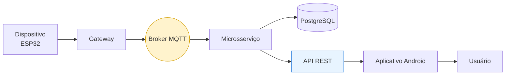
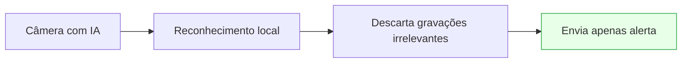
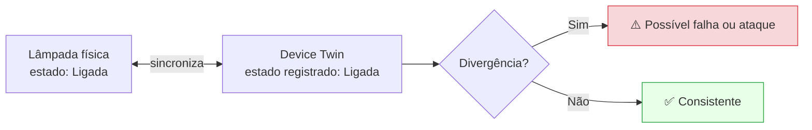
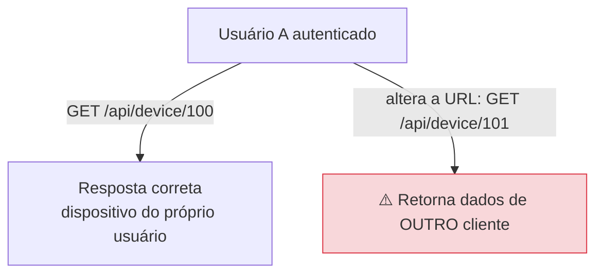
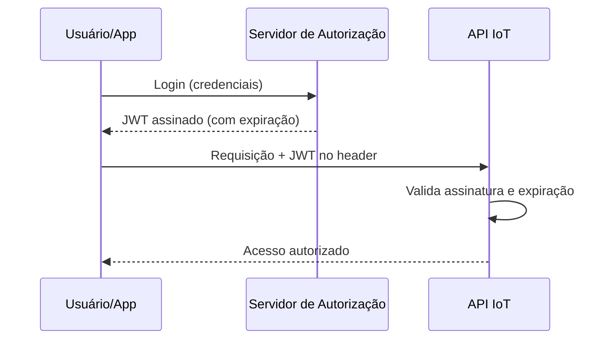
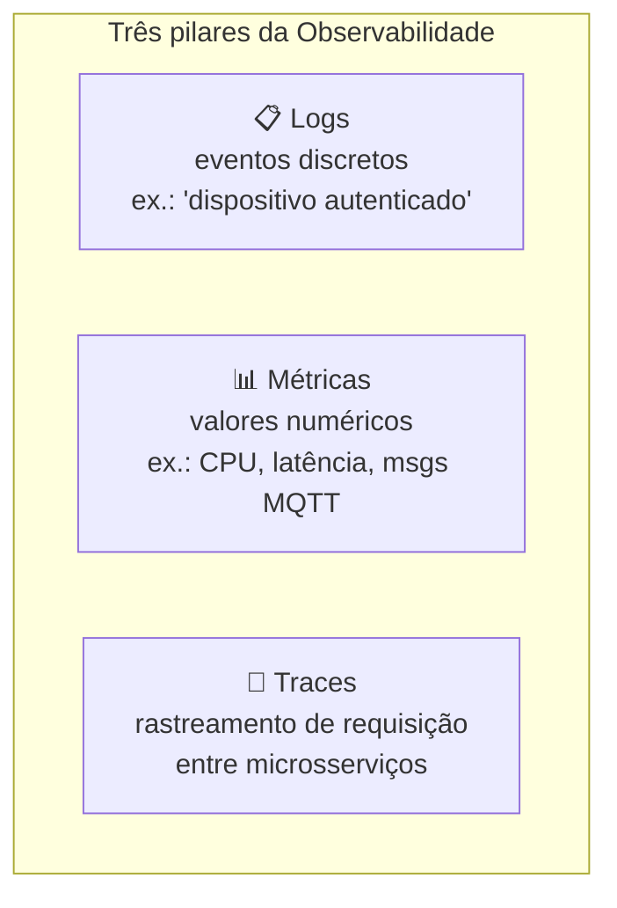
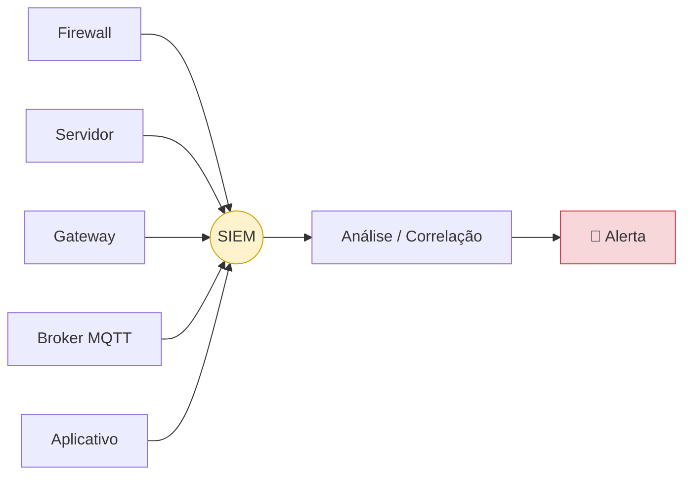
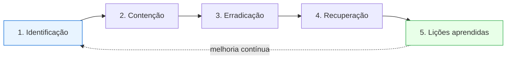
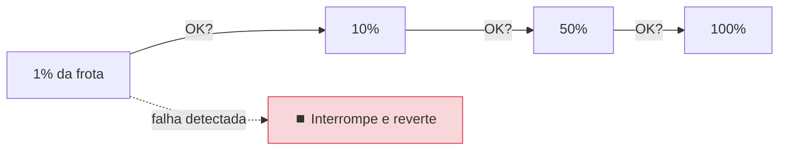
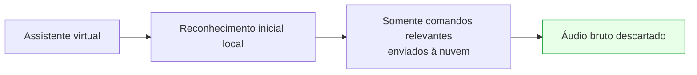

# Volume VI — Segurança em Cloud, Edge Computing, APIs, Observabilidade e Resposta a Incidentes

---

## 1. Introdução

Nos volumes anteriores estudamos a segurança do dispositivo físico, do firmware, dos protocolos de comunicação e dos ambientes industriais. Entretanto, um dispositivo IoT **raramente opera sozinho** — na maioria dos casos faz parte de um ecossistema muito maior: gateways, brokers MQTT, APIs REST, bancos de dados, plataformas em nuvem, dashboards, aplicativos móveis, serviços de autenticação e monitoramento.

Essa infraestrutura constitui o chamado **backend IoT**.

Paradoxalmente, muitos ataques modernos **não exploram diretamente o dispositivo** — atacam essa infraestrutura. De nada adianta criptografia de última geração no sensor se a API permitir que qualquer usuário visualize dados de outros clientes.

---

## Objetivos deste volume

Ao final deste capítulo o estudante deverá compreender:

- arquitetura moderna em Cloud IoT;
- Edge Computing (revisitado);
- Digital Twin / Device Twin;
- APIs REST seguras;
- autenticação baseada em OAuth2 e JWT;
- observabilidade (logs, métricas, traces);
- SIEM e monitoramento contínuo;
- resposta a incidentes;
- boas práticas em plataformas IoT.

---

## 2. Arquitetura Moderna de uma Plataforma IoT

Um sistema IoT moderno é composto por diversos serviços independentes (microsserviços). A divisão facilita escalabilidade, manutenção, disponibilidade e atualização independente — mas aumenta o número de componentes a proteger.

Caso apenas um desses componentes seja comprometido, toda a arquitetura poderá ser afetada.

---

## 3. Edge Computing Revisitado

No Volume I apresentamos o Edge Computing. Aqui aprofundamos sua importância para a **segurança**. Processar informações próximas da origem reduz latência, exposição de dados, consumo de banda e dependência da Internet.

**Benefícios para segurança:** menos dados circulando pela Internet, menor risco de interceptação, redução de custos e preservação da privacidade.

---

## 4. Digital Twin e Device Twin

O **Digital Twin** é uma representação virtual de um equipamento físico (configuração, estado atual, sensores, histórico, eventos). No contexto IoT é comum o termo **Device Twin** ou **Device Shadow**: a nuvem mantém uma cópia lógica do estado esperado do dispositivo.

Caso exista divergência entre ambos, o sistema pode detectar falhas ou possíveis ataques.

> **💡 Curiosidade:** A **AWS IoT Core** usa o conceito de *Device Shadow*; o **Microsoft Azure IoT Hub** usa *Device Twin*. Embora tenham diferenças de implementação, seguem princípios semelhantes.

---

## 5. APIs REST

Grande parte da comunicação entre aplicativos móveis e plataformas IoT ocorre por **APIs REST**, responsáveis por cadastrar dispositivos, consultar sensores, alterar configurações, enviar comandos e visualizar históricos. Por isso são alvos extremamente atrativos.

**Vulnerabilidades comuns:** autenticação inadequada, autorização incorreta, exposição excessiva de dados, validação insuficiente e ausência de *rate limiting*.

### BOLA (Broken Object Level Authorization)

Uma das vulnerabilidades mais perigosas (nº 1 do **OWASP API Security Top 10**): a API autentica o usuário, mas **não verifica se ele pode acessar aquele objeto específico**.

> **⚠️ Atenção:** Grande parte dos incidentes recentes com dispositivos inteligentes ocorreu por falhas em **APIs**, e não nos equipamentos físicos.

---

## 6. OAuth2 e JWT

Em plataformas modernas, a autenticação normalmente ocorre com **OAuth2**. Após autenticar-se, o usuário recebe um **token**, frequentemente um **JWT** (JSON Web Token).

**Vantagens:** autenticação centralizada, escalabilidade e integração com múltiplos serviços.

> **⚠️ Cuidados com tokens:** devem possuir tempo de expiração, assinatura digital e armazenamento seguro. **Jamais** em texto puro.

---

## 7. Observabilidade

Monitorar sistemas IoT vai além de verificar se estão ligados: é preciso compreender continuamente desempenho, disponibilidade, consumo, erros e comportamento. A **Observabilidade** baseia-se em três pilares.

> **🔍 Na prática:** Ferramentas amplamente utilizadas: **Prometheus** (métricas), **Grafana** (visualização), **OpenTelemetry** (instrumentação), **Loki** (logs) e **Jaeger** (traces).

---

## 8. SIEM

**SIEM** (*Security Information and Event Management*) centraliza e **correlaciona** eventos de diversos equipamentos, permitindo detecção precoce, investigação de incidentes, auditoria e conformidade.

**Exemplos:** Splunk, IBM QRadar, Microsoft Sentinel, Elastic Security, Wazuh.

---

## 9. Edge Analytics

Nem toda análise precisa ocorrer na nuvem. **Edge Analytics** analisa dados diretamente nos gateways: o gateway identifica comportamento anômalo e somente eventos relevantes seguem para a nuvem, reduzindo largura de banda, processamento e armazenamento.

---

## 10. Resposta a Incidentes

Mesmo sistemas bem projetados podem sofrer ataques. Toda organização deve possuir um plano de resposta, tipicamente em cinco fases (alinhado ao NIST SP 800-61):

### Exemplo

Um dispositivo começa a enviar milhares de mensagens MQTT → o sistema detecta a anomalia → o gateway bloqueia o dispositivo → o administrador recebe alerta → o firmware é analisado → uma atualização corretiva é distribuída.

---

## 11. Atualizações em larga escala

Grandes fabricantes administram milhões de dispositivos. Atualizar todos simultaneamente é arriscado; por isso utilizam **implantação gradual (canary rollout)**.

Essa abordagem reduz significativamente impactos de atualizações defeituosas.

---

## 12. Computação em Nuvem aplicada à IoT

| Plataforma | Recursos principais |
| ----------- | --------------------- |
| **AWS IoT Core** | Broker MQTT, Device Shadow, autenticação por certificados, integração com Lambda, gerenciamento de frota |
| **Microsoft Azure IoT Hub** | Device Twin, provisionamento automático (DPS), OTA, integração com Azure Digital Twins |
| **Google Cloud** | Serviço IoT Core dedicado descontinuado (2023); componentes (Pub/Sub, Dataflow) seguem em arquiteturas IoT |

> **💡 Curiosidade:** A maioria das plataformas comerciais **não** utiliza usuário/senha para autenticar dispositivos — a autenticação ocorre por **certificados digitais exclusivos**.

---

## 13. Privacy by Design

Dispositivos modernos coletam informações sensíveis: localização, voz, vídeo, frequência cardíaca, padrões de sono. Diversas legislações (LGPD, GDPR — ver Volume VIII) exigem que a privacidade seja considerada **desde o início**. Princípios: minimização da coleta, transparência, consentimento, anonimização e processamento local sempre que possível.

---

## Resumo do Volume

Neste capítulo estudamos a infraestrutura que sustenta ecossistemas modernos de IoT. Foram apresentados Edge Computing, Device Twin, APIs REST, OAuth2, JWT, SIEM, Observabilidade, Edge Analytics e Resposta a Incidentes, além de plataformas em nuvem e princípios de proteção da privacidade.

Esses mecanismos demonstram que a segurança em IoT não depende apenas do dispositivo físico, mas de **toda a infraestrutura distribuída** responsável por armazenar, processar e disponibilizar suas informações.

---

## Perguntas para discussão

1. Processar dados localmente sempre aumenta a segurança?
2. APIs REST representam atualmente um dos maiores riscos em plataformas IoT?
3. Como a observabilidade auxilia na detecção de ataques?
4. Qual a importância dos Device Twins para manutenção preventiva?
5. Vale a pena armazenar todo o histórico de sensores na nuvem?

---

## Possíveis perguntas do professor

- **Qual a diferença entre Device Twin e Digital Twin?**
- **O que é BOLA e por que é considerada uma vulnerabilidade crítica?**
- **Por que OAuth2 e JWT são amplamente utilizados em plataformas IoT?**
- **Como um SIEM contribui para a segurança de ambientes distribuídos?**
- **Quais vantagens o Edge Computing oferece além da redução da latência?**
- **Por que Privacy by Design tornou-se um requisito importante?**

---

## Leituras recomendadas

- OWASP API Security Top 10 (2023)
- NIST Cybersecurity Framework (CSF) 2.0
- NIST SP 800-61 — *Computer Security Incident Handling Guide*
- Microsoft Azure IoT Security Documentation
- AWS IoT Core — Security Best Practices
- OpenTelemetry Documentation
- ENISA — Guidelines for IoT

---

## Encerramento da Parte II

Ao longo desta segunda parte foram estudados os aspectos mais críticos da segurança em ambientes industriais e plataformas IoT modernas. Compreendemos como arquiteturas industriais usam segmentação e o Modelo Purdue para proteger infraestruturas críticas, analisamos ataques históricos que transformaram a segurança de IoT em prioridade mundial e exploramos os mecanismos de autenticação, monitoramento, observabilidade e resposta a incidentes empregados na nuvem.

Na próxima e última parte serão abordados o ciclo de vida seguro dos dispositivos, normas e legislações internacionais, estudos de caso e um guia completo para apresentação de seminário, monitoria e atividades de sala de aula invertida.

**Continua na Parte III — Volume VII: Ciclo de Vida Seguro dos Dispositivos IoT.**
