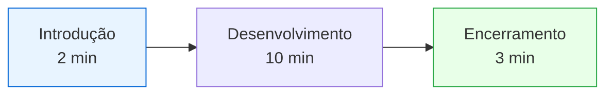
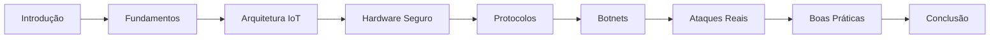
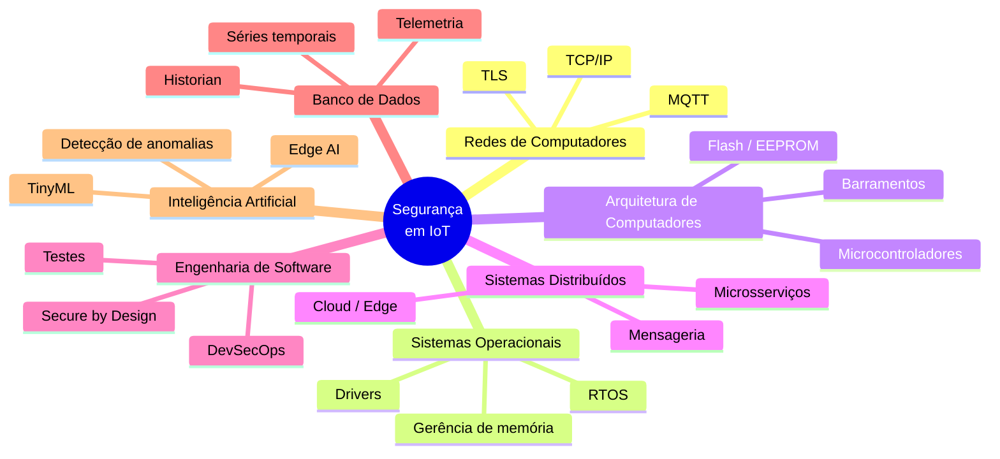

# Volume X — Guia para Apresentação, Monitoria, Sala de Aula Invertida e Banco de Perguntas

---

## 1. Introdução

Este último volume possui objetivo diferente dos anteriores. Enquanto os demais apresentaram conceitos técnicos, este é um **guia prático** para preparar seminários, monitorias, apresentações acadêmicas, atividades de sala de aula invertida e debates em grupo.

Seu foco é transformar o conhecimento adquirido em uma apresentação clara, organizada e tecnicamente consistente, além de reunir perguntas frequentes que ajudam o estudante a desenvolver domínio do assunto.

---

## Objetivos deste volume

Ao final o estudante deverá ser capaz de: organizar uma apresentação técnica; explicar conceitos complexos de maneira acessível; responder perguntas frequentes; conduzir discussões em grupo; relacionar teoria e prática; e conectar os diferentes tópicos do dossiê.

---

## 2. Roteiro para apresentação (15 minutos)

### Introdução (2 min)

Apresente rapidamente: o crescimento da IoT, exemplos do cotidiano e a importância da segurança.

> "Hoje bilhões de dispositivos estão conectados à Internet — em casas, hospitais, indústrias e cidades inteligentes. Essa conectividade trouxe inúmeros benefícios, mas também ampliou significativamente a superfície de ataque."

### Desenvolvimento (10 min)

IoT e IIoT · principais vulnerabilidades · botnets · Mirai · autenticação · criptografia · atualizações OTA · boas práticas.

### Encerramento (3 min)

Enfatize: segurança deve ser planejada desde o projeto; dispositivos precisam permanecer atualizados; fabricantes têm papel fundamental; usuários também têm responsabilidades.

---

## 3. Roteiro para apresentação (30 minutos)

---

## 4. Roteiro para uma aula de 50 minutos

| Parte | Tema | Duração |
| ------- | ------ | --------- |
| 1 | Introdução | 10 min |
| 2 | Funcionamento da IoT | 10 min |
| 3 | Ataques | 10 min |
| 4 | Mitigações | 10 min |
| 5 | Discussão em grupo | 10 min |

> **Dica:** Evite usar apenas definições. Sempre associe cada conceito a um exemplo do cotidiano.

**Exemplo — ao explicar uma botnet:**

> "Imagine um exército formado por milhares de câmeras de segurança espalhadas pelo mundo. Cada câmera continua gravando normalmente. Entretanto, todas aguardam ordens de um criminoso. Quando recebem um comando, passam a atacar simultaneamente um único servidor."

---

## 5. Analogias úteis

| Conceito | Analogia |
| ---------- | ---------- |
| **Root of Trust** | Certidão de nascimento do dispositivo — tudo começa nela |
| **Certificado Digital** | Passaporte — comprova quem é o dispositivo |
| **TLS** | Envelope lacrado — todos veem que uma carta foi enviada, mas só o destinatário a lê |
| **Firewall** | Porteiro de condomínio — decide quem pode entrar |
| **Segmentação de Redes** | Compartimentos de um navio — se um vaza, os demais continuam protegidos |
| **Secure Boot** | Lacre de um medicamento — se estiver violado, não deve ser utilizado |

---

## 6. Erros conceituais comuns

| ❌ Erro | ✅ Correto |
| --------- | ----------- |
| IoT é apenas automação residencial | IoT engloba qualquer dispositivo conectado capaz de coletar, processar ou transmitir informações |
| MQTT é um protocolo seguro | MQTT precisa de mecanismos adicionais, como TLS |
| Criptografia impede qualquer invasão | Ela protege dados, mas não elimina vulnerabilidades de software |
| Firewall resolve todos os problemas | Firewalls são apenas uma camada da Defesa em Profundidade |
| Atualizar firmware sempre aumenta a segurança | Atualizações precisam ser assinadas e validadas; senão introduzem riscos |

---

## 7. Perguntas que provavelmente surgirão

| Pergunta | Resposta curta |
| ---------- | ---------------- |
| O que é IoT? | Rede de dispositivos físicos capazes de coletar, processar e compartilhar informações |
| O que diferencia IoT de IIoT? | IIoT foca ambientes industriais, onde disponibilidade e segurança operacional são prioridade |
| O que é uma botnet? | Conjunto de dispositivos comprometidos controlados remotamente |
| O que foi o Mirai? | Uma das maiores botnets da história; explorava credenciais padrão |
| O que é Secure Boot? | Mecanismo que impede a execução de firmware adulterado |
| O que é Flash Encryption? | Criptografia da memória Flash contra leitura física do firmware |
| O que é Edge Computing? | Processamento próximo da origem dos dados |
| O que é Device Twin? | Representação virtual do estado de um dispositivo |
| O que é OTA? | Atualização remota de firmware |
| O que é Root of Trust? | Base de confiança do dispositivo, ancorada em hardware |

---

## 8. Perguntas desafiadoras (nível professor)

**Se um atacante obtiver acesso físico ao dispositivo, a criptografia ainda é suficiente?**
> Depende. Sem Secure Boot, Flash Encryption e Secure Elements, o acesso físico pode permitir extração de firmware e chaves.

**Por que ainda existem protocolos inseguros como Modbus?**
> Porque milhares de equipamentos industriais seguem em operação. Substituí-los teria custo altíssimo; usam-se controles compensatórios (VPNs, segmentação, firewalls industriais).

**É possível construir um dispositivo totalmente seguro?**
> Não. Segurança absoluta não existe; o objetivo é reduzir riscos a níveis aceitáveis.

**Por que dispositivos baratos apresentam mais vulnerabilidades?**
> Restrições de custo levam fabricantes a reduzir memória, processamento e recursos de segurança.

**A Inteligência Artificial resolverá os problemas de segurança em IoT?**
> Não. Ela auxilia na detecção de anomalias, mas também pode ser usada por atacantes.

---

## 9. Atividade para Sala de Aula Invertida

**Cenário:** residência com Smart TV, assistente virtual, câmera IP, fechadura inteligente, aspirador robô e tomadas inteligentes — todos no mesmo roteador.

**Perguntas:**

- Quais dispositivos apresentam maior risco?
- Como segmentar essa rede?
- Quais informações precisam ser protegidas?
- Quais vulnerabilidades podem existir?
- Quais boas práticas deveriam ser implementadas?

---

## 10. Mini estudo de caso

Um fabricante descobre uma **vulnerabilidade crítica** em milhares de câmeras IP já vendidas. Discuta:

- Como comunicar os clientes?
- Como distribuir atualizações?
- Como evitar indisponibilidade?
- Como impedir exploração antes da correção?
- Como recuperar a confiança dos consumidores?

---

## 11. Checklist para apresentação

Antes de apresentar, confirme se você consegue explicar:

- [ ] O que é IoT
- [ ] O que é IIoT
- [ ] Diferença entre TI e OT
- [ ] O que é uma botnet
- [ ] Como funciona o Mirai
- [ ] O que é Secure Boot
- [ ] O que é Flash Encryption
- [ ] O que é TLS
- [ ] O que é MQTT
- [ ] O que é CoAP
- [ ] O que é Edge Computing
- [ ] O que é Device Twin
- [ ] O que é SBOM
- [ ] O que é Secure by Design
- [ ] O que é o Modelo Purdue
- [ ] O que é a ISA/IEC 62443
- [ ] O que é o NIST CSF
- [ ] O que é o OWASP IoT Top 10
- [ ] O que é o STRIDE
- [ ] O que é o MITRE ATT&CK

---

## 12. Conexão com outras disciplinas

---

## 13. Conclusão Geral do Dossiê

A Internet das Coisas representa uma das maiores transformações tecnológicas do século XXI. Ao conectar bilhões de dispositivos físicos à Internet, tornou-se possível automatizar residências, otimizar processos industriais, monitorar cidades, melhorar serviços de saúde e aumentar a eficiência de diversos setores.

Entretanto, essa conectividade ampliou proporcionalmente a superfície de ataque. Os dispositivos deixaram de ser apenas "computadores simplificados" e passaram a controlar diretamente processos físicos, aproximando o mundo digital do mundo real. Nesse contexto, a segurança precisa ser tratada como requisito **fundamental e permanente**.

Ao longo deste dossiê foram estudados:

- fundamentos da IoT e IIoT;
- sistemas ciberfísicos;
- hardware seguro e identidade digital;
- protocolos de comunicação e criptografia;
- ataques reais e botnets;
- segurança industrial;
- computação em nuvem;
- ciclo de vida seguro;
- normas internacionais;
- estudos de caso.

Todos esses elementos demonstram que proteger dispositivos IoT exige uma abordagem **multidisciplinar** envolvendo engenharia de hardware, desenvolvimento de software, redes, criptografia, computação em nuvem, gestão de riscos e conformidade.

Mais do que impedir invasões, a segurança em IoT busca garantir que dispositivos conectados permaneçam **confiáveis, disponíveis e capazes de desempenhar suas funções de forma segura durante todo o seu ciclo de vida**.

À medida que tecnologias como Inteligência Artificial, Edge Computing e redes 6G se tornam mais presentes, a necessidade de incorporar princípios como **Secure by Design**, **Zero Trust** e **Privacy by Design** tende a crescer. Assim, o profissional da área deve compreender que segurança não é um produto ou ferramenta, mas um **processo contínuo** de identificação, avaliação e mitigação de riscos.

---

## Referências Bibliográficas

- ANDERSON, Ross. *Security Engineering: A Guide to Building Dependable Distributed Systems*. 3ª ed.
- CHANTZIS, Fotios et al. *Practical IoT Hacking*. No Starch Press.
- NIST. *Cybersecurity Framework (CSF) 2.0*. 2024.
- NIST. *IR 8259 Series* — Foundational Cybersecurity Activities for IoT Device Manufacturers.
- NIST. *SP 800-82 Rev. 3* — Guide to Operational Technology (OT) Security.
- NIST. *SP 800-193* — Platform Firmware Resiliency Guidelines.
- ISA/IEC. *62443 Series*.
- ETSI. *EN 303 645* — Cyber Security for Consumer IoT.
- OWASP. *IoT Project / IoT Top 10 (2018)* e *API Security Top 10 (2023)*.
- MITRE. *ATT&CK for ICS*.
- IETF. *RFC 8446 (TLS 1.3)*, *RFC 7252 (CoAP)*, *RFC 8613 (OSCORE)*.
- OASIS. *MQTT Version 5.0 Specification*.
- UNIÃO EUROPEIA. *Cyber Resilience Act — Regulation (EU) 2024/2847*.
- BRASIL. *Lei Geral de Proteção de Dados (Lei nº 13.709/2018)*.
- UNIÃO EUROPEIA. *General Data Protection Regulation (GDPR) — Regulation (EU) 2016/679*.

---

## Fim do Dossiê

**Parabéns!** Você concluiu um material estruturado para apoiar estudos, apresentações, monitorias e discussões sobre **Segurança da Informação em Dispositivos IoT**, cobrindo desde os fundamentos até aplicações práticas, normas internacionais e tendências da área.
