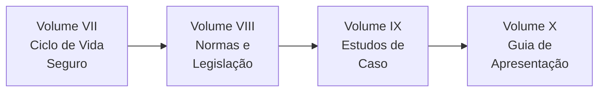
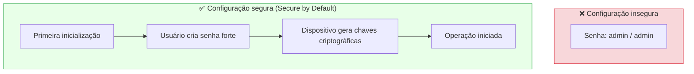
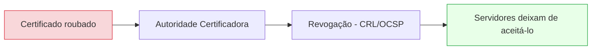
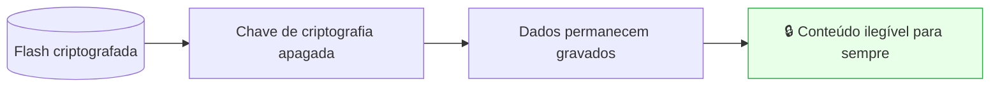
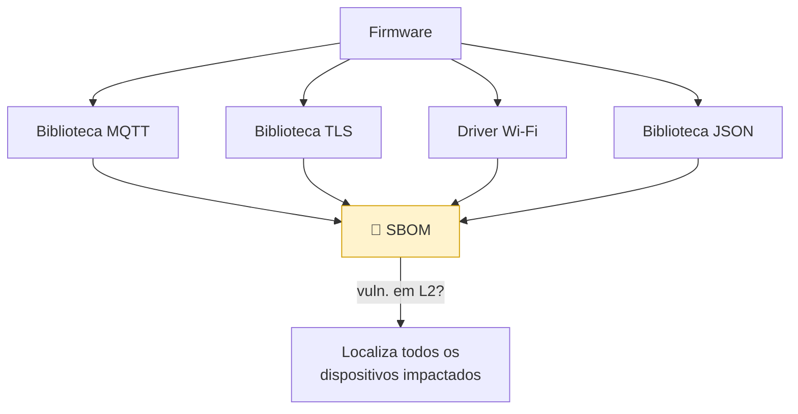
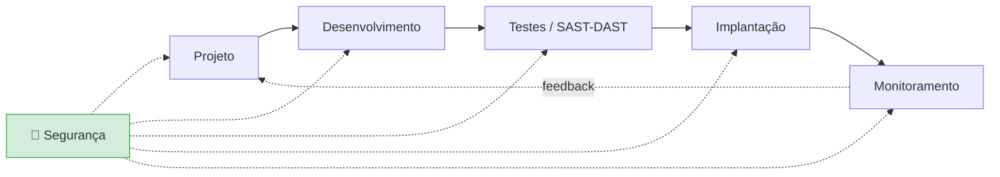

# Parte III

## Volume VII — Ciclo de Vida Seguro dos Dispositivos IoT

---

## Mapa da Parte III

---

## 1. Introdução

Uma das maiores diferenças entre um dispositivo IoT e um software convencional está no seu **ciclo de vida**. Enquanto um aplicativo pode ser atualizado várias vezes ao dia, um dispositivo embarcado pode permanecer em operação por cinco, dez ou até vinte anos.

Isso significa que sua segurança não depende apenas de boas práticas de programação, mas de decisões tomadas **desde a fabricação até o descarte**. Esse conceito é conhecido como **Secure Device Lifecycle**. Em vez de tratar a segurança como etapa isolada, ela acompanha todas as fases do produto.

---

## Objetivos deste volume

Ao final deste capítulo o estudante deverá compreender:

- o ciclo de vida de dispositivos IoT;
- Secure Development Lifecycle (SDL);
- Secure by Design e Secure by Default;
- gerenciamento de vulnerabilidades (CVE/CVSS);
- atualização de firmware;
- gerenciamento e rotação de certificados;
- descomissionamento seguro;
- Supply Chain Security e SBOM;
- DevSecOps.

---

## 2. O ciclo de vida de um dispositivo IoT

Cada fase apresenta riscos específicos. Uma câmera IP pode ser muito segura na fabricação, mas tornar-se vulnerável com o tempo caso **nunca receba atualizações**.

---

## 3. Secure by Design

Nos últimos anos, diversos governos passaram a exigir que fabricantes incorporem segurança **desde o início** do desenvolvimento. Em vez de corrigir problemas após o lançamento, busca-se evitá-los durante o projeto: escolha adequada do microcontrolador, autenticação por certificados, Secure Boot, Flash Encryption, OTA e proteção física.

> **💡 Curiosidade — custo:** Corrigir uma vulnerabilidade na fase de projeto pode custar **dezenas de vezes menos** do que corrigi-la após milhões de dispositivos vendidos.

---

## 4. Secure by Default

Além de projetar corretamente, os dispositivos devem **sair de fábrica seguros**: Telnet desabilitado, sem senhas padrão, criptografia ativada, autenticação obrigatória e logs importantes registrados. O usuário não deveria precisar configurar manualmente recursos básicos de segurança.

---

## 5. Provisionamento Seguro

Provisionar é preparar o dispositivo para produção: gravação do firmware, instalação de certificados, registro em servidores, associação ao cliente e configuração inicial. Todo o processo deve ocorrer em ambiente controlado — caso contrário, milhares de equipamentos podem **nascer inseguros** (ver Volume II).

---

## 6. Gerenciamento de Vulnerabilidades

Nenhum software é perfeito; novas vulnerabilidades continuarão sendo descobertas durante toda a vida útil. O fabricante deve possuir processos para receber relatos, analisar, corrigir e distribuir atualizações.

| Sigla | Significado | Função |
| ------- | ------------- | -------- |
| **CVE** | Common Vulnerabilities and Exposures | Identificador único de cada vulnerabilidade (ex.: CVE-2020-11901) |
| **CVSS** | Common Vulnerability Scoring System | Pontuação de gravidade (0.0 a 10.0) |
| **CWE** | Common Weakness Enumeration | Categoriza o *tipo* de fraqueza |

O **CVSS** estima a gravidade: quanto maior a pontuação, maior a prioridade de correção.

| Faixa CVSS v3.1 | Severidade |
| ----------------- | ------------ |
| 0.1 – 3.9 | Baixa |
| 4.0 – 6.9 | Média |
| 7.0 – 8.9 | Alta |
| 9.0 – 10.0 | Crítica |

---

## 7. Atualizações OTA

Atualizações Over-The-Air são um dos principais mecanismos de manutenção da segurança, mas precisam ser cuidadosamente planejadas. Boas práticas: assinatura digital, criptografia, rollback automático, validação de integridade e atualização gradual.

> **⚠️ Atenção:** Atualizar rapidamente é importante. Atualizar **sem validação** pode ser ainda mais perigoso — uma atualização não assinada é um vetor direto para código malicioso.

---

## 8. Rotação e Revogação de Certificados

Certificados digitais possuem prazo de validade e precisam ser renovados periodicamente (**rotação**). Caso um certificado comprometido permaneça válido, um invasor poderá continuar usando-o. Quando uma chave é comprometida, ela deve ser **revogada** imediatamente (via CRL ou OCSP).

---

## 9. Descomissionamento Seguro

Todo dispositivo chega ao fim da vida útil. Simplesmente desligá-lo não basta: antes do descarte devem ser removidos certificados, senhas, tokens, informações pessoais e chaves criptográficas.

### Cryptographic Erase

Técnica amplamente utilizada: apagar apenas a **chave** responsável por descriptografar os dados. Mesmo que toda a memória permaneça intacta, as informações tornam-se **irrecuperáveis**.

---

## 10. Supply Chain Security

A segurança também depende dos **componentes de terceiros**. Um firmware pode conter dezenas de bibliotecas; se uma delas tiver vulnerabilidade, todo o sistema é afetado (ex.: **Ripple20**, que afetou a pilha TCP/IP da Treck usada em milhões de dispositivos).

### SBOM (Software Bill of Materials)

Inventário completo contendo bibliotecas, versões, dependências e componentes utilizados. Facilita identificar rapidamente quais dispositivos são afetados quando surge uma nova vulnerabilidade.

---

## 11. DevSecOps

Tradicionalmente, desenvolvimento e segurança eram tratados separadamente. O **DevSecOps** integra a segurança de forma contínua em todo o pipeline (*shift-left*).

---

## 12. Boas práticas

Um fabricante moderno deve:

- implementar Secure Boot;
- utilizar Flash Encryption;
- remover senhas padrão;
- fornecer atualizações OTA assinadas;
- usar autenticação baseada em certificados;
- manter SBOM atualizado;
- responder rapidamente a novas vulnerabilidades (PSIRT / disclosure responsável);
- oferecer suporte durante todo o ciclo de vida do produto.

---

## Resumo do Volume

Neste capítulo estudamos a segurança ao longo de todo o ciclo de vida dos dispositivos IoT. Foram apresentados Secure by Design, Secure by Default, Provisionamento Seguro, gerenciamento de vulnerabilidades (CVE/CVSS), DevSecOps, SBOM, Rotação de Certificados e Descomissionamento Seguro.

Esses conceitos demonstram que proteger um dispositivo não significa apenas desenvolver um firmware seguro, mas **manter continuamente sua segurança desde a fabricação até o descarte**.

---

## Perguntas para discussão

1. Um fabricante deveria ser obrigado a fornecer atualizações durante toda a vida útil do dispositivo?
2. Qual a importância do SBOM diante de vulnerabilidades em bibliotecas de terceiros?
3. Vale a pena manter dispositivos sem suporte conectados à Internet?
4. O descarte inadequado de um equipamento representa risco de segurança?
5. Por que Secure by Design reduz custos a longo prazo?

---

## Possíveis perguntas do professor

- **O que diferencia Secure by Design de Secure by Default?**
- **Qual a função de um SBOM?**
- **Por que atualizações OTA devem ser assinadas digitalmente?**
- **O que é Cryptographic Erase?**
- **Por que um dispositivo continua exigindo cuidados mesmo após deixar de ser utilizado?**

---

## Leituras recomendadas

- NIST SP 800-193 — *Platform Firmware Resiliency*
- NIST IR 8259
- NTIA — *The Minimum Elements For a Software Bill of Materials (SBOM)*
- Cyber Resilience Act (CRA)
- ETSI EN 303 645

---

**Continua no Volume VIII — Normas, Frameworks, Legislação e Boas Práticas Internacionais.**
