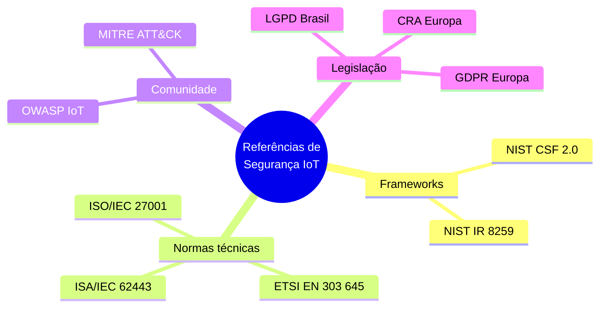
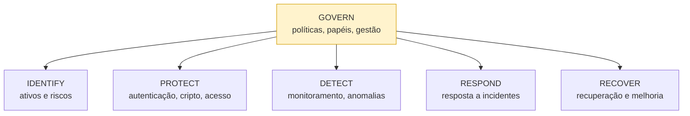
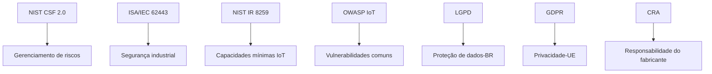

# Volume VIII — Normas, Frameworks, Legislação e Boas Práticas Internacionais

---

## 1. Introdução

Até aqui estudamos diversos mecanismos técnicos de proteção. Surge, porém, uma questão importante:

> Como saber se um dispositivo realmente atende a requisitos mínimos de segurança?

A resposta está nas **normas técnicas, frameworks de segurança e legislações internacionais**. Esses documentos estabelecem princípios, processos, responsabilidades e requisitos mínimos que fabricantes, desenvolvedores, integradores e organizações devem seguir. Em ambientes industriais, governamentais e corporativos, segui-los deixou de ser recomendação — em muitos casos, tornou-se **requisito contratual ou legal**.

---

## Objetivos deste volume

Compreender: NIST Cybersecurity Framework, NIST IR 8259, ISA/IEC 62443, ETSI EN 303 645, OWASP IoT Project, MITRE ATT&CK, LGPD, GDPR, Cyber Resilience Act, ISO/IEC 27001 e princípios gerais de conformidade.

---

## 2. Por que normas são importantes?

Sem padronização, cada fabricante implementaria segurança de forma diferente, dificultando auditorias, certificações, integração e avaliação de riscos. As normas fornecem uma **linguagem comum**: empresas conseguem definir requisitos mínimos independentemente do fabricante.

### Panorama das principais referências

---

## 3. NIST Cybersecurity Framework (CSF 2.0)

O **NIST** (*National Institute of Standards and Technology*) desenvolveu um dos frameworks mais utilizados no mundo — um guia para **gerenciamento de riscos**. A versão **2.0 (2024)** organiza a segurança em **seis funções** (a função **Govern** foi adicionada na 2.0).

| Função | Objetivo |
| -------- | ---------- |
| **Govern** | Definir políticas, papéis, responsabilidades e gestão de riscos organizacional |
| **Identify** | Identificar ativos, riscos e conhecer a infraestrutura |
| **Protect** | Implementar controles preventivos |
| **Detect** | Monitorar continuamente e identificar anomalias |
| **Respond** | Responder de forma organizada aos incidentes |
| **Recover** | Recuperar operações e aplicar lições aprendidas |

> **💡 Curiosidade:** Embora criado nos EUA, o NIST CSF tornou-se referência **internacional**.

---

## 4. NIST IR 8259

Enquanto o CSF é amplo, a série **NIST IR 8259** foi desenvolvida especificamente para **dispositivos IoT**. Define capacidades técnicas fundamentais que todo equipamento deveria possuir: identificação única, configuração segura, proteção lógica de dados, atualização segura, monitoramento e gerenciamento de vulnerabilidades. Serve tanto para fabricantes quanto para compradores.

---

## 5. ISA/IEC 62443

Principal conjunto de normas para **segurança industrial** (SCADA, PLCs, RTUs, DCS, redes industriais). Divide responsabilidades entre participantes:

| Papel | Responsabilidade |
| ------- | ------------------ |
| **Fabricantes** | Desenvolver produtos seguros |
| **Integradores** | Implantar arquiteturas adequadas |
| **Operadores** | Manter a segurança durante toda a vida útil |

Conceitos-chave: Defense in Depth, segmentação (zonas e conduítes), gestão de riscos, controle de acesso, atualizações e monitoramento. Grande parte das grandes indústrias a utiliza como referência.

---

## 6. ETSI EN 303 645

Norma europeia criada especificamente para dispositivos IoT **de consumo**. Foca em eliminar problemas extremamente comuns:

- proibição de senhas universais padrão;
- atualizações seguras;
- proteção de dados pessoais;
- minimização da superfície de ataque;
- gerenciamento de vulnerabilidades (canal de divulgação).

> **Exemplo:** um fabricante não deveria vender milhares de câmeras com usuário `admin` e senha `admin`. Essa prática é explicitamente desencorajada pela ETSI EN 303 645.

---

## 7. OWASP IoT Project

Uma das maiores referências mundiais em segurança de aplicações. Além do famoso OWASP Top 10 para Web, mantém uma iniciativa específica para IoT (o **IoT Top 10** — ver Volume V), reunindo vulnerabilidades, estudos, recomendações e boas práticas. Muitos laboratórios a usam como **checklist** em avaliações.

---

## 8. MITRE ATT&CK

O **MITRE ATT&CK** não é uma norma — é uma **base de conhecimento** sobre técnicas de atacantes (invasão, persistência, movimentação lateral, coleta, exfiltração). Existe a versão **for ICS** para ambientes industriais. Ajuda equipes a compreender *como* os ataques acontecem e quais controles impedem cada etapa.

---

## 9. LGPD

A **Lei Geral de Proteção de Dados** (Lei nº 13.709/2018) protege informações pessoais no Brasil e aplica-se também a dispositivos IoT (relógios inteligentes, assistentes virtuais, câmeras, apps domésticos). Princípios: finalidade, necessidade, transparência, segurança, responsabilização e prestação de contas.

> **Exemplo:** uma câmera residencial não deve coletar informações além das necessárias à sua finalidade (princípio da **minimização**).

---

## 10. GDPR

Na Europa, a principal legislação é o **GDPR** (Regulation (EU) 2016/679), que influenciou diversas leis no mundo — inclusive a LGPD. Princípios: consentimento, direito ao esquecimento, portabilidade, minimização de dados e **Privacy by Design**.

---

## 11. Cyber Resilience Act (CRA)

O **Cyber Resilience Act** representa uma evolução importante na regulamentação de produtos digitais na União Europeia, responsabilizando fabricantes pela segurança de seus produtos "com elementos digitais".

> **📅 Datas verificadas:** O CRA **entrou em vigor em 10 de dezembro de 2024**, com aplicação faseada:
>
> - **11 de setembro de 2026** — obrigações de **notificação** de vulnerabilidades ativamente exploradas e incidentes graves à ENISA (em até 24 horas);
> - **11 de dezembro de 2027** — aplicação das **obrigações principais** (avaliação de risco, requisitos essenciais de cibersegurança, documentação técnica, avaliação de conformidade e marcação CE).

Requisitos: desenvolvimento seguro, correção de vulnerabilidades, atualizações durante período de suporte definido, divulgação responsável de falhas e documentação de segurança.

> **⚠️ Atenção:** Embora seja legislação europeia, fabricantes internacionais frequentemente adaptam seus produtos para atender ao CRA (efeito extraterritorial de fato, semelhante ao GDPR).

---

## 12. ISO/IEC 27001

A **ISO/IEC 27001** não trata exclusivamente de IoT — estabelece requisitos para **Sistemas de Gestão da Segurança da Informação (SGSI)**. Organizações certificadas demonstram processos formais para gerenciamento de riscos, controle de ativos, auditoria e continuidade de negócios. Frequentemente exigida como requisito contratual.

---

## 13. Como essas normas se complementam

Cada documento possui um foco; juntos, oferecem visão abrangente.

| Referência | Foco principal |
| ----------- | ---------------- |
| NIST CSF 2.0 | Gerenciamento de riscos |
| ISA/IEC 62443 | Segurança industrial (OT) |
| NIST IR 8259 | Capacidades mínimas de dispositivos IoT |
| ETSI EN 303 645 | IoT de consumo |
| OWASP IoT | Vulnerabilidades comuns |
| LGPD / GDPR | Proteção de dados / privacidade |
| CRA | Responsabilidade do fabricante |
| ISO/IEC 27001 | Gestão organizacional (SGSI) |

### Boas práticas convergentes

Independentemente da norma, praticamente todas convergem para: autenticação forte, criptografia, atualizações seguras, monitoramento contínuo, gestão de vulnerabilidades, **menor privilégio**, **defesa em profundidade** e **segurança desde o projeto**.

---

## Resumo do Volume

Foram apresentadas as principais normas, frameworks e legislações de segurança em IoT: NIST CSF 2.0, NIST IR 8259, ISA/IEC 62443, ETSI EN 303 645, OWASP IoT Project, MITRE ATT&CK, LGPD, GDPR, Cyber Resilience Act e ISO/IEC 27001.

Embora com objetivos distintos, todas convergem para um princípio: a segurança deve ser **planejada desde o início e mantida durante todo o ciclo de vida** do dispositivo.

---

## Perguntas para discussão

1. Um dispositivo pode ser considerado seguro apenas por cumprir uma norma?
2. Qual a diferença entre legislação e norma técnica?
3. Como a LGPD influencia o desenvolvimento de dispositivos IoT?
4. O Cyber Resilience Act pode modificar o mercado mundial?
5. Vale a pena investir em certificações internacionais?

---

## Possíveis perguntas do professor

- **Qual a diferença entre o NIST CSF e o NIST IR 8259?**
- **Por que a ISA/IEC 62443 é referência para ambientes industriais?**
- **O que a ETSI EN 303 645 busca combater?**
- **Como a LGPD afeta dispositivos inteligentes?**
- **Qual o principal objetivo do Cyber Resilience Act?**
- **O MITRE ATT&CK é uma norma? Explique.**

---

## Leituras recomendadas

- NIST Cybersecurity Framework 2.0 (2024)
- NIST IR 8259 Series
- ISA/IEC 62443
- ETSI EN 303 645
- OWASP IoT Project
- MITRE ATT&CK for ICS
- LGPD (Lei nº 13.709/2018)
- GDPR (Regulation (EU) 2016/679)
- Cyber Resilience Act — Regulation (EU) 2024/2847

---

**Continua no Volume IX — Estudos de Caso, Cenários Reais e Aplicações Práticas em IoT e IIoT.**
