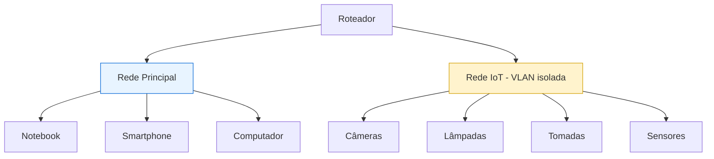
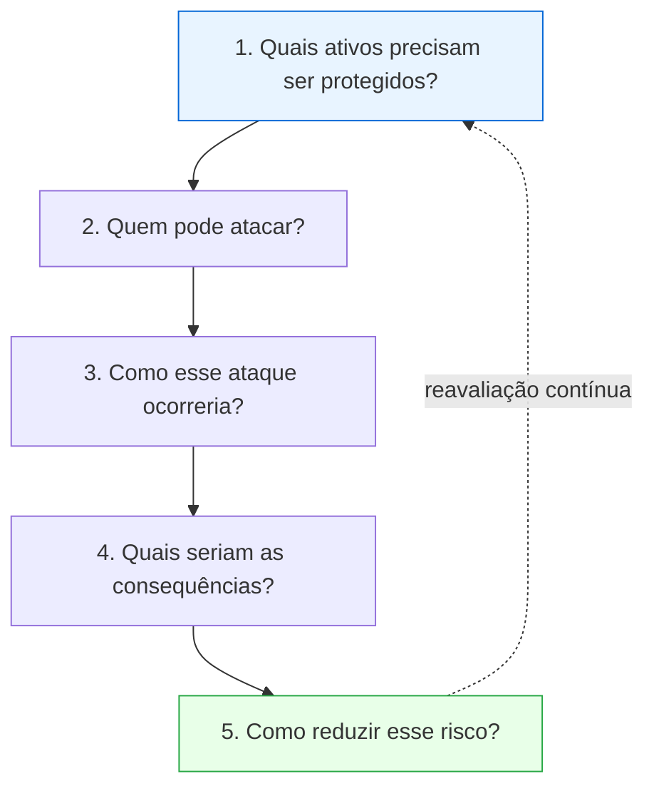

# Volume IX — Estudos de Caso, Cenários Reais e Aplicações Práticas em IoT e IIoT

---

## 1. Introdução

Após compreender conceitos fundamentais, mecanismos de segurança, ataques e normas, torna-se importante observar como essas tecnologias se aplicam no mundo real.

Os estudos de caso deste capítulo têm dois objetivos: (1) demonstrar como diferentes setores utilizam IoT; (2) analisar quais riscos surgem em cada cenário e quais mecanismos de segurança devem ser empregados. Essa abordagem desenvolve a visão crítica essencial a profissionais de Engenharia de Computação, Segurança da Informação e Sistemas Embarcados.

---

## Objetivos deste volume

Compreender: aplicações reais de IoT, ameaças específicas de cada setor, consequências de ataques, estratégias de mitigação, relação entre teoria e prática e importância da análise de risco.

---

## Estudo de Caso 1 — Casa Inteligente (Smart Home)

**Cenário:** uma residência com fechadura inteligente, câmera IP, lâmpadas, Smart TV, assistente virtual, tomadas inteligentes, sensores de presença e roteador Wi-Fi — todos na mesma rede.

| Aspecto | Análise |
| --------- | --------- |
| **Benefícios** | Automação, conforto, economia de energia, monitoramento remoto |
| **Riscos** | Senhas padrão, Wi-Fi mal configurado, firmware desatualizado, APIs inseguras |
| **Consequências** | Espionagem, invasão, desligamento de alarmes, vazamento de imagens, botnets |
| **Mitigações** | WPA3, autenticação forte, atualização automática, **VLAN exclusiva para IoT**, desativar serviços desnecessários |

### Segmentação recomendada

Essa segmentação reduz significativamente os impactos caso um dispositivo seja comprometido.

---

## Estudo de Caso 2 — Agricultura Inteligente

**Cenário:** fazenda com sensores de umidade, temperatura, luminosidade, vento e irrigação, transmitindo via **LoRaWAN** para um gateway e, então, para a nuvem.

| Aspecto | Análise |
| --------- | --------- |
| **Benefícios** | Economia de água, aumento de produtividade, previsão climática, irrigação automática |
| **Ameaças** | Alterar leituras, impedir comunicação, provocar irrigação inadequada, comprometer gateways |
| **Consequências** | Perda da produção, desperdício de água, prejuízo financeiro |
| **Boas práticas** | Autenticação sensor↔gateway, redundância, monitoramento, Edge Computing |

> **💡 Curiosidade:** Grandes fazendas podem possuir **milhares de sensores** distribuídos por dezenas de quilômetros — o que torna LoRaWAN (longo alcance, baixo consumo) especialmente adequado.

---

## Estudo de Caso 3 — Hospital Inteligente

**Cenário:** hospital com bombas de infusão, monitores cardíacos, respiradores, rastreamento de equipamentos e controle de temperatura.

**Desafio central:** a **disponibilidade** torna-se crítica — interromper um equipamento pode colocar vidas em risco.

| Aspecto | Análise |
| --------- | --------- |
| **Ataques possíveis** | Ransomware, alteração de parâmetros, indisponibilidade, acesso não autorizado |
| **Consequências** | Atraso em atendimentos, perda de informações, **riscos à vida** |
| **Mitigações** | Segmentação de redes, autenticação forte, monitoramento, redundância, backups, atualização controlada |

> **⚠️ Atenção:** Em hospitais, **segurança da informação e segurança do paciente caminham juntas** — um conceito de convergência *safety/security*.

---

## Estudo de Caso 4 — Cidade Inteligente

**Cenário:** prefeitura controlando iluminação pública, semáforos, estacionamento, sensores ambientais e monitoramento urbano.

| Aspecto | Análise |
| --------- | --------- |
| **Benefícios** | Economia de energia, mobilidade, monitoramento ambiental, resposta rápida |
| **Riscos** | Congestionamentos, apagões, indisponibilidade de serviços, coleta indevida de dados |
| **Estratégias** | Autenticação por certificados, segmentação, SIEM, SOC, criptografia ponta a ponta |

---

## Estudo de Caso 5 — Indústria 4.0

**Cenário:** fábrica automatizada com PLCs, sensores, robôs, SCADA, Historian, MES e ERP integrados.

| Aspecto | Análise |
| --------- | --------- |
| **Benefícios** | Manutenção preditiva, produtividade, redução de desperdícios, tempo real |
| **Ameaças** | Ransomware, movimentação lateral, ataques a PLCs, sabotagem, alteração de sensores |
| **Consequências** | Interrupção da produção, perdas financeiras, acidentes, danos ambientais |
| **Mitigações** | Modelo Purdue, ISA/IEC 62443, DMZ Industrial, autenticação, segmentação |

---

## Estudo de Caso 6 — Veículos Conectados

**Cenário:** automóveis com dezenas de ECUs, GPS, sensores, radares, câmeras e módulos LTE em comunicação contínua (barramento **CAN**).

| Aspecto | Análise |
| --------- | --------- |
| **Benefícios** | Assistência ao motorista, navegação, diagnósticos remotos, OTA |
| **Ameaças** | Comprometimento remoto, alteração de comandos, espionagem, rastreamento |
| **Mitigações** | Secure Boot, barramentos protegidos, autenticação, atualizações assinadas |

> **🔍 Contexto:** A norma **ISO/SAE 21434** (Cybersecurity for road vehicles) e o regulamento **UNECE R155** tornaram a cibersegurança veicular requisito regulatório para homologação.

---

## Estudo de Caso 7 — Redes Elétricas Inteligentes (Smart Grid)

**Cenário:** medidores inteligentes, sensores, relés digitais e SCADA.

| Aspecto | Análise |
| --------- | --------- |
| **Benefícios** | Melhor distribuição, identificação de falhas, redução de perdas |
| **Ameaças** | Fraude em medidores, interrupção do fornecimento, alteração de medições |
| **Consequências** | Prejuízos econômicos, apagões, instabilidade energética |

---

## Estudo de Caso 8 — Logística Inteligente

**Cenário:** monitoramento de caminhões, contêineres, cargas, temperatura e localização.

| Aspecto | Análise |
| --------- | --------- |
| **Benefícios** | Rastreamento, redução de perdas, monitoramento em tempo real |
| **Riscos** | Falsificação de localização (GPS spoofing), perda de rastreamento, roubo |
| **Mitigações** | GPS autenticado, criptografia, redundância, Edge Analytics |

---

## Comparação entre cenários

| Ambiente | Prioridade principal | Maior risco |
| ----------- | ---------------------- | ------------- |
| Casa Inteligente | Privacidade | Invasão doméstica |
| Hospital | Disponibilidade | Risco à vida |
| Agricultura | Continuidade | Perda da produção |
| Cidade Inteligente | Disponibilidade | Interrupção de serviços |
| Indústria | Segurança operacional | Paralisação da produção |
| Energia | Continuidade | Apagões |
| Logística | Integridade | Roubo e fraude |

---

## Como analisar um cenário IoT

Uma metodologia usada em praticamente todas as análises profissionais responde cinco perguntas:

### Estudo de caso integrador

Considere uma residência inteligente com roteador Wi-Fi, câmera IP, fechadura eletrônica, assistente virtual, Smart TV, sensor de fumaça e iluminação inteligente. Perguntas de análise:

- Qual dispositivo representa maior risco?
- Todos deveriam permanecer na mesma rede?
- O que aconteceria caso a câmera fosse comprometida?
- Como impedir que ela participe de uma botnet?
- Como proteger a privacidade dos moradores?

---

## Resumo do Volume

Foram apresentados diversos cenários reais de IoT e IIoT. Os estudos demonstraram que cada ambiente possui requisitos específicos: residências priorizam privacidade, hospitais enfatizam disponibilidade, indústrias concentram-se na continuidade operacional e cidades inteligentes equilibram segurança, desempenho e escalabilidade.

Independentemente do cenário, os princípios fundamentais permanecem: autenticação forte, criptografia, monitoramento contínuo, segmentação de redes, atualização segura e análise constante de riscos.

---

## Perguntas para discussão

1. Qual dos cenários apresenta maior impacto potencial em caso de ataque?
2. A segurança de uma casa inteligente depende apenas dos dispositivos?
3. Como Edge Computing pode beneficiar hospitais?
4. Quais seriam os maiores desafios para proteger uma cidade inteligente?
5. Por que diferentes ambientes priorizam diferentes requisitos de segurança?

---

## Possíveis perguntas do professor

- **Qual a principal diferença entre IoT residencial e IIoT?**
- **Por que hospitais possuem requisitos de segurança tão rigorosos?**
- **Como a segmentação de redes protege uma residência inteligente?**
- **Qual a importância da Edge Computing em ambientes agrícolas?**
- **Por que veículos conectados necessitam de atualizações OTA seguras?**
- **Quais lições os estudos de caso apresentam para futuros projetos IoT?**

---

## Leituras recomendadas

- ENISA — *Good Practices for Security of Smart Homes*
- ENISA — *Smart Hospitals: Security and Resilience*
- NIST — *Framework and Roadmap for Smart Grid Interoperability*
- ISO/SAE 21434 — *Road vehicles — Cybersecurity engineering*
- *IEEE Internet of Things Journal*

---

**Continua no Volume X — Guia para Apresentação, Monitoria, Sala de Aula Invertida e Banco de Perguntas.**
