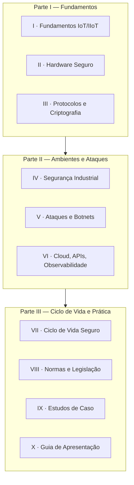

# 🔒 IoT Knowledge Hub

## Engenharia de Computação • UFG • 2026/3

> Hub de ideação, documentação e consolidação dos materiais produzidos durante a disciplina de **Internet das Coisas (IoT)**, ofertada no período **2026/3 (Férias de Inverno)** da Universidade Federal de Goiás.

---

## 📖 Sobre

Este repositório reúne, organiza e documenta o conhecimento produzido ao longo da disciplina de **Internet das Coisas (IoT)**.

Diferentemente de um repositório de projetos, este espaço funciona como uma **base de conhecimento acadêmica**, concentrando materiais produzidos durante as aulas, pesquisas, seminários, estudos individuais e demais atividades.

A proposta é que toda documentação permaneça organizada e sirva futuramente como material de consulta para disciplinas correlatas, projetos de pesquisa, iniciação científica e trabalhos de conclusão de curso.

---

## 🎯 Objetivos

- Centralizar toda a produção da disciplina em um único local.
- Organizar pesquisas e estudos realizados durante o semestre.
- Facilitar consultas futuras.
- Documentar o processo de aprendizagem.
- Servir como material de apoio para apresentações, monitorias e revisões.

---

## 📚 Dossiê Técnico — Segurança da Informação em Dispositivos IoT

O principal material disponível é o **Dossiê Técnico de Segurança da Informação em Dispositivos IoT**, estruturado em **3 partes** e **10 volumes**.

> 📄 Para uma visão consolidada de todo o conteúdo, consulte o **[Contexto Detalhado do Repositório](CONTEXTO.md)**.

### 🗺️ Trilha de leitura



### 📑 Índice dos volumes

| # | Volume | Temas centrais |
| --- | -------- | ---------------- |
| I | [Fundamentos da Segurança em IoT e IIoT](Dossie/Parte%201/Volume%201.md) | IoT × IIoT, CPS, Edge/Fog/Cloud, STRIDE |
| II | [Hardware Seguro e Raiz de Confiança](Dossie/Parte%201/Volume%202.md) | Root of Trust, Secure Boot, Flash Encryption, TrustZone |
| III | [Protocolos, Criptografia e Comunicação Segura](Dossie/Parte%201/Volume%203.md) | MQTT, CoAP, TLS/DTLS, PKI, mTLS, OTA |
| IV | [Segurança Industrial (IIoT) e Arquitetura Purdue](Dossie/Parte%202/Volume%204.md) | TI×OT, ICS/SCADA, Purdue, segmentação |
| V | [Ataques Reais, Botnets e Modelagem de Ameaças](Dossie/Parte%202/Volume%205.md) | Mirai, DDoS, STRIDE, OWASP IoT Top 10 |
| VI | [Cloud, Edge, APIs, Observabilidade e Resposta a Incidentes](Dossie/Parte%202/Volume%206.md) | Device Twin, BOLA, OAuth2/JWT, SIEM |
| VII | [Ciclo de Vida Seguro dos Dispositivos IoT](Dossie/Parte%203/Volume%207.md) | Secure by Design, CVE/CVSS, SBOM, DevSecOps |
| VIII | [Normas, Frameworks e Legislação Internacional](Dossie/Parte%203/Volume%208.md) | NIST CSF 2.0, ISA/IEC 62443, ETSI, LGPD, GDPR, CRA |
| IX | [Estudos de Caso e Aplicações Práticas](Dossie/Parte%203/Volume%209.md) | Smart Home, Hospital, Indústria 4.0, Smart Grid |
| X | [Guia para Apresentação e Sala de Aula Invertida](Dossie/Parte%203/Volume%2010.md) | Roteiros, analogias, banco de perguntas |

---

## 📂 Estrutura do Repositório

```text
.
├── README.md              → este arquivo (visão geral e navegação)
├── CONTEXTO.md            → contexto detalhado de todo o conteúdo
└── Dossie/
    ├── Parte 1/           → Volumes I, II, III (Fundamentos)
    ├── Parte 2/           → Volumes IV, V, VI (Ambientes e Ataques)
    └── Parte 3/           → Volumes VII, VIII, IX, X (Ciclo de Vida e Prática)
```

> 💡 Os diagramas do dossiê usam **[Mermaid](https://mermaid.js.org/)**, renderizado nativamente pelo GitHub. Basta abrir os arquivos `.md` para visualizá-los.

---

## 🧩 Temas de Interesse

Ao longo da disciplina, este repositório aborda assuntos como:

`IoT` · `IIoT` · `Sistemas Ciberfísicos (CPS)` · `Edge/Fog Computing` · `Computação em Nuvem` ·
`MQTT` · `CoAP` · `TLS/DTLS` · `Bluetooth Low Energy` · `LoRaWAN` ·
`Segurança da Informação` · `Botnets` · `Modelagem de Ameaças (STRIDE)` · `Arquiteturas Seguras` ·
`Criptografia` · `Hardware Seguro` · `Atualizações OTA` · `Smart Cities` · `Indústria 4.0` ·
`Normas e Frameworks Internacionais`

---

## 🚧 Evolução do Repositório

Este repositório será expandido gradualmente conforme o avanço da disciplina. Novos materiais poderão incluir: pesquisas, estudos dirigidos, apresentações, diagramas, mapas mentais, resumos, exercícios, estudos de caso, laboratórios e documentação complementar.

---

## 📚 Referências

Os documentos utilizam como base materiais provenientes de:

- IEEE Xplore · ACM Digital Library
- NIST · OWASP · IETF RFCs
- ISA/IEC 62443 · ETSI EN 303 645
- ENISA · MITRE ATT&CK
- Livros técnicos especializados e documentação oficial de fabricantes

As referências específicas são apresentadas ao final de cada volume.

---

## 🎓 Informações da Disciplina

| Item | Informação |
| ------ | ------------ |
| UA concedente | Instituto de Informática (UFG) |
| Disciplina | Internet das Coisas (IoT) |
| Período | 2026/3 (Férias de Inverno) |

---

## 👨‍💻 Autores

**HIGOR FERREIRA SILVA*

Graduando em Engenharia de Computação — Universidade Federal de Goiás (UFG)

**KHALIL ALVES MOTTA*

Graduando em Ciência da Computação — Universidade Federal de Goiás (UFG)

**LOURENCO TABOSA PANIAGO*

Graduando em Ciência da Computação — Universidade Federal de Goiás (UFG)

**WILSON MARANHÃO RAMOS FILHO*

Graduando em Ciência da Computação — Universidade Federal de Goiás (UFG)

---

> *"A melhor documentação não registra apenas resultados, mas também a evolução do conhecimento ao longo do processo de aprendizagem."*
