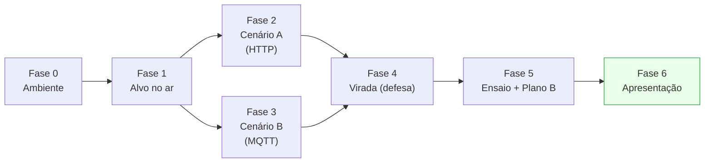

# Roadmap — Demo de Segurança em IoT (Seminário G6)

> Plano de execução do preparo até o palco. Dois cenários (**A: HTTP+brute force**,
> **B: MQTT+injeção**), duas versões (**simulada** na VM dedicada, **física** no ESP32),
> broker **na Kali**, duas VMs na **mesma rede interna**.

## Visão geral (fases)



## Marcos e checklist por fase

### Fase 0 — Ambiente (base de tudo)
> Atalho: `sudo bash kali/setup.sh` faz os 5 primeiros itens de uma vez. Entre ensaios, `sudo bash kali/reset.sh`.
- [ ] Duas VMs na **mesma rede interna/host-only**; `ping` OK entre elas.
- [ ] IPs anotados: `IP_KALI`, `IP_VM_ESP32`.
- [ ] Kali com `wireshark`, `hydra`, `mosquitto`, `mosquitto-clients`.
- [ ] Broker mosquitto inseguro no ar (`listener 1883 0.0.0.0`, `allow_anonymous true`).
- [ ] Wordlist `~/wordlist_demo.txt` criada (contém `admin123`).
- 📄 `kali/01_preparacao.md`

### Fase 1 — Alvo no ar
- [ ] **Simulada:** `dispositivo_iot.py --broker <IP_KALI> --http-port 80` rodando na VM-alvo.
- [ ] **Física (se for usar):** `firmware_esp32.ino` gravado, ESP32 na rede, IP anotado.
- [ ] `curl http://<IP_VM_ESP32>/` mostra o painel.
- [ ] `mosquitto_sub -h <IP_KALI> -t casa/porta -v` recebe um `abrir` de teste.
- [ ] `mosquitto_sub -h <IP_KALI> -t casa/telemetria -v` recebe telemetria (DHT22/NTC).
- [ ] `python3 dispositivo_iot.py --broker <IP_KALI> --self-test` retorna PRONTO.
- 📄 `dispositivo_vm/dispositivo_iot.py` · `firmware_esp32/`

### Fase 2 — Cenário A (HTTP)
- [ ] Wireshark filtro `http` captura `senha=admin123` no POST /login.
- [ ] `hydra` encontra `admin:admin123`.
- [ ] Print de reserva do Wireshark e do hydra salvos.
- 📄 `kali/02_cenarioA_http_bruteforce.md`

### Fase 3 — Cenário B (MQTT)
- [ ] Wireshark filtro `mqtt` mostra `casa/porta = abrir` legível.
- [ ] `mosquitto_pub ... -m abrir` destrava o alvo (tela ou relé).
- [ ] Print/vídeo de reserva salvos.
- 📄 `kali/03_cenarioB_mqtt_injecao.md`

### Fase 4 — Virada (defesa)
- [ ] Senha forte aplicada → hydra falha.
- [ ] Broker com TLS (8883) + auth → injeção anônima rejeitada.
- [ ] Wireshark mostra tráfego **cifrado**.
- [ ] (Se física) firmware ajustado para TLS, se for demonstrar o legítimo pós-virada.
- 📄 `kali/04_virada_defesa.md`

### Fase 5 — Ensaio + Plano B
- [ ] Ensaio cronometrado ≤ 10 min (slot da Pessoa 4).
- [ ] Decidir **qual cenário vai ao vivo** e qual vira vídeo/prints.
- [ ] Pasta de prints/vídeos de reserva pronta (todos os atos).

### Fase 6 — Apresentação
- [ ] Seguir o roteiro de palco (abaixo).
- 📄 `docs/Demo_Seguranca_IoT_G6.md` (seção 5)

## Dependências (o que trava o quê)
- **Fase 0 → tudo:** sem rede/broker, nada funciona.
- **Broker (Fase 0) → Cenário B e virada:** a injeção e a captura MQTT dependem do broker na Kali.
- **String de falha correta (`Senha incorreta`) → hydra:** se errada, o hydra dá falso-positivo.
- **TLS/certs (Fase 4) → captura cifrada e rejeição:** é a parte mais sensível; ensaiar.

## Recomendação de escopo para o palco (10 min)
- **Ao vivo:** Cenário A completo (interceptar + hydra) — é o que o roteiro do Wilson prioriza (HTTP×HTTPS).
- **Ao vivo (curto):** injeção MQTT do Cenário B — o `mosquitto_pub` abrindo a porta é rápido e visual (ótimo no físico).
- **Vídeo/prints:** a virada TLS (demora a configurar; melhor mostrar pronta).

## Ordem sugerida de execução (dia a dia)
1. **Dia 1:** Fase 0 + Fase 1 (ambiente e alvo no ar). Salvar tudo funcionando.
2. **Dia 2:** Fase 2 e Fase 3 (os dois ataques), capturando prints/vídeos.
3. **Dia 3:** Fase 4 (virada) — a que mais dá trabalho.
4. **Dia 4:** Fase 5 (ensaio + plano B) e revisão dos slides da Pessoa 4.

## Mapa dos arquivos do pacote
```
pacote/
├── ROADMAP.md                         <- este arquivo
├── docs/
│   └── Demo_Seguranca_IoT_G6.md       <- documentação completa (arquitetura, roteiro de palco)
├── dispositivo_vm/
│   └── dispositivo_iot.py             <- alvo simulado (web vivo + MQTT + telemetria + self-test + TLS)
├── firmware_esp32/
│   ├── firmware_esp32.ino             <- alvo físico (web + MQTT + DHT22 + NTC)
│   ├── LIGACAO_ESP32.md               <- mapeamento de pinos + esquemático (texto)
│   ├── LIGACAO_ESP32.svg              <- esquemático (imagem)
│   ├── COMPONENTES.svg                <- diagrama de blocos (imagem)
│   └── gerar_svg.py                   <- regenera os SVGs
└── kali/
    ├── setup.sh                       <- instala tudo, sobe broker, cria wordlist
    ├── reset.sh                       <- restaura estado entre ensaios
    ├── 01_preparacao.md               <- rede, ferramentas, self-test
    ├── 02_cenarioA_http_bruteforce.md <- interceptação HTTP + hydra
    ├── 03_cenarioB_mqtt_injecao.md    <- interceptação MQTT + injeção
    └── 04_virada_defesa.md            <- TLS + senha forte + auth
```

## Ressalvas honestas (valem para todo o pacote)
- **Wokwi não é atacável ao vivo** — a versão "simulada alcançável" usa a **VM dedicada**, não o Wokwi.
- **Sintaxe a confirmar** na sua versão: `hydra` (`http-post-form`), `mosquitto`/TLS, `WiFiClientSecure`/`PubSubClient` (ESP32). O `dispositivo_iot.py` foi testado em Python; o `.ino` é um **esqueleto a compilar/validar** no seu ambiente (não foi compilado aqui).
- **Ambiente controlado:** rede isolada, só contra o próprio dispositivo do grupo.
