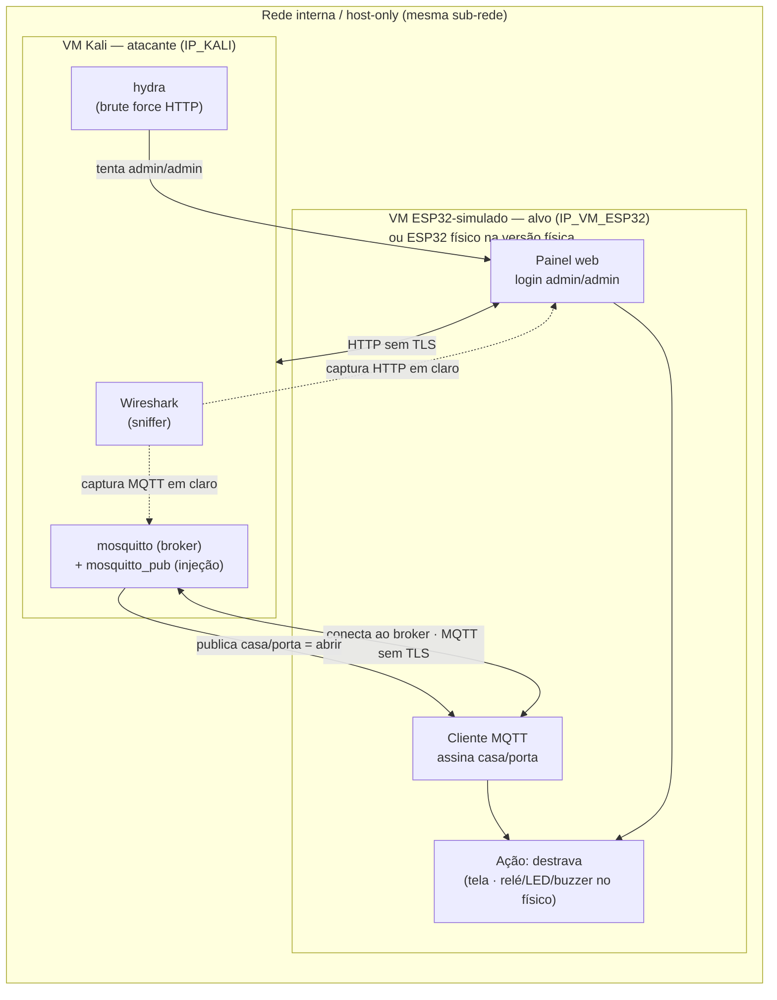
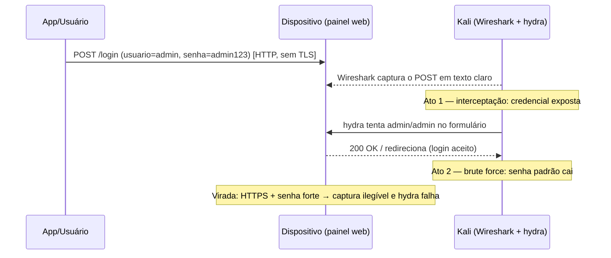
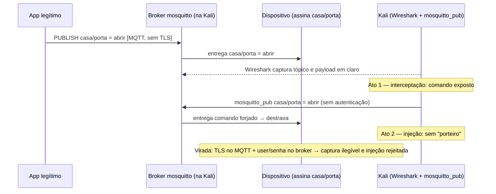
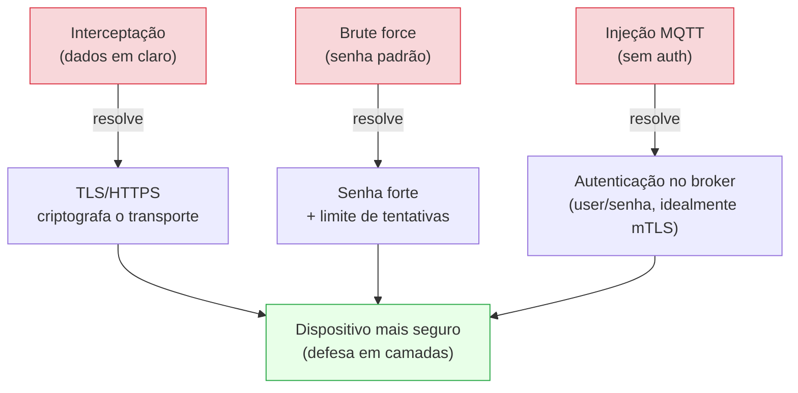

# Demonstração Prática — Segurança em IoT
### Seminário G6 · Pessoa 4 (Wilson) · Interceptação + Ataque em um dispositivo IoT

> **Objetivo:** mostrar, em ambiente local e controlado, como uma "fechadura/câmera inteligente" mal protegida pode ser **interceptada** e **comprometida** — e como **TLS + autenticação forte** revertem os dois problemas.
>
> A demo tem **dois cenários** e roda em **duas versões** (mesmo playbook de ataque):
> - **Cenário A — HTTP + brute force** (painel de login com senha padrão)
> - **Cenário B — MQTT + injeção** (comando de dispositivo sem autenticação)
> - **Versão física:** o alvo é um **ESP32 real** que aciona relé/LED/buzzer.
> - **Versão simulada:** o alvo é um **"dispositivo-processo"** rodando numa **VM dedicada** (o "ESP32 simulado"), **na mesma rede interna** da Kali e **alcançável ao vivo**.
>
> **Topologia (fixada):** duas VMs na **mesma rede interna/host-only** — `VM Kali` (atacante, e onde roda o **broker mosquitto**) e `VM ESP32-simulado` (alvo). Na versão física, a `VM ESP32-simulado` é substituída pelo **ESP32 real** na mesma rede. O **broker fica sempre na Kali**, o que garante a captura do tráfego MQTT sem ARP spoofing.

---

## ⚠️ Aviso ético (colocar no slide)

Esta demonstração é executada **exclusivamente em rede isolada e contra o próprio dispositivo do grupo**. O objetivo é **educacional** — evidenciar o risco de comunicações sem criptografia e de credenciais/serviços sem autenticação. Nenhum sistema de terceiros é alvo.

---

## Novidades da versão 2 do pacote

- **Dashboard web redesenhado** (tema escuro tecnológico, azul/ciano): herói da trava
  em verde/vermelho com ícone 🔒/🔓, três cartões de telemetria, placar de ataque e log —
  tudo **ao vivo via SSE, sem F5**.
- **Tela de login dedicada** (`GET /login`): layout em duas colunas com identidade do
  dispositivo (câmera CAM-G6, motivo de hexágonos) e o formulário com aviso de "HTTP sem TLS".
- **Placar de ataque em tempo real:** contadores de tentativas HTTP, falhas de login e injeções MQTT.
- **Telemetria de sensores:** DHT22 (temperatura + umidade) e NTC 10k (temperatura), publicada em `casa/telemetria` — dado sensível trafegando, além do comando.
- **Log didático:** cada evento marcado como *"visto pelo atacante"* × *"protegido"*.
- **`--self-test`:** o dispositivo confere HTTP/MQTT/telemetria antes do palco.
- **`setup.sh` / `reset.sh`:** preparam a Kali e restauram o estado entre ensaios.
- **Painel HTTPS opcional (`--tls`):** permite fazer a **virada 100% ao vivo** também no HTTP.
- **Esquemático + diagrama de componentes** (SVG) e **mapeamento de pinos** para a versão física.

### Rotas HTTP do dispositivo (para a demo e o Wireshark)
| Rota | Método | O que é |
|------|--------|---------|
| `/` | GET | **Dashboard** ao vivo (monitoramento + login embutido) |
| `/login` | GET | **Tela de login** dedicada (visual "câmera IoT") |
| `/login` | POST | processa o login → destrava ou "Senha incorreta" (alvo do `hydra`) |
| `/state` | GET | JSON do estado (telemetria, placar, log) |
| `/events` | GET | fluxo **SSE** que alimenta o dashboard ao vivo |
| `/status` | GET | texto simples (para telão/monitor) |
| `/healthz` | GET | usado pelo `--self-test` |

> **Dica de palco:** projete o **dashboard** (`/`) — o placar e o log reagindo aos ataques
> em tempo real são o efeito visual mais forte. Para a captura do `hydra`, use a **tela de
> login** (`/login`) ou o POST direto.

---

## 1. Por que esta demo (ligação com a teoria)

| Ato | O que mostra | Conceito do seminário |
|-----|--------------|-----------------------|
| Interceptação | Dados/comando trafegam em texto claro | Comunicação insegura · Confidencialidade (tríade CIA) |
| Brute force (HTTP) | Senha padrão `admin/admin` cai rápido | Credenciais padrão · Broken authentication |
| Injeção (MQTT) | Qualquer um publica o comando `abrir` | Serviço sem autenticação · Broken authentication |
| Virada (defesa) | TLS + senha forte + auth no broker | Criptografia protege o transporte, **mas não substitui autenticação** |

**Mensagem-chave:** criptografia (HTTPS/TLS) resolve a **interceptação**, mas **senha forte** e **autenticação no broker** é que resolvem brute force e injeção. Segurança é em camadas.

---

## 2. Componentes necessários

### 2.1 Comuns às duas versões
- **VM Kali Linux** (a "estação atacante").
- **Wireshark** (dissector MQTT e HTTP nativos).
- **mosquitto** + **mosquitto-clients** (broker MQTT + `mosquitto_pub`/`mosquitto_sub`) — o **broker roda na VM Kali**. Como o alvo se conecta a esse broker, todo o tráfego MQTT passa pela Kali e o Wireshark captura localmente, **sem ARP spoofing**.
- **hydra** (brute force do formulário HTTP).
- Uma **wordlist** curta e controlada (com a senha-alvo incluída, para a demo ser confiável).
- **Rede interna/host-only** ligando as VMs: `VM Kali` e `VM ESP32-simulado` (ou o ESP32 físico) na **mesma sub-rede**, sem saída para a internet. Confirmar que as máquinas **se pingam** antes de começar.

### 2.2 Versão simulada (100% sem hardware, alcançável ao vivo)
- **Uma VM dedicada** — o **"ESP32 simulado"** — na **mesma rede interna** da Kali, com IP próprio (`<IP_VM_ESP32>`). Nela roda o **"dispositivo-processo"**:
  - um **servidor web** simples com página de login (`admin/admin`);
  - um **cliente MQTT** que **conecta ao broker da Kali** (`<IP_KALI>`) e assina o tópico `casa/porta`.
- Sem componentes físicos. O "destravar" aparece **na tela** da VM-alvo (página muda para `ACESSO LIBERADO`).
- O Kali ataca `<IP_VM_ESP32>` (HTTP) e injeta comandos pelo broker local (MQTT) — tudo **ao vivo**, como se fosse um dispositivo real na rede.

### 2.3 Versão física (sabor IoT máximo)
- **1× ESP32 DevKit v1** (o dispositivo-alvo).
- **1× cabo micro-USB** (alimentação/gravação).
- **1× módulo relé** (1 canal; a "trava" da porta).
- **1× LED verde** + **1× resistor 330 Ω** (status "liberado").
- **1× buzzer ativo 5V** (beep de acesso).
- **1× DHT22** (AM2302) — telemetria: temperatura + umidade.
- **1× NTC 10k** + **1× resistor 10k** — telemetria: temperatura (divisor de tensão).
- **Protoboard + jumpers**.
- *(Opcional)* **LED vermelho** + resistor 330 Ω para status "negado/sob ataque".

> **Mapeamento de pinos, esquemático e diagrama de componentes:** ver
> `firmware_esp32/LIGACAO_ESP32.md`, `firmware_esp32/LIGACAO_ESP32.svg` (esquemático)
> e `firmware_esp32/COMPONENTES.svg` (diagrama de blocos).
>
> **Por que sensores?** eles dão um motivo real para o dispositivo **publicar dados**
> (`casa/telemetria`). Assim a interceptação mostra **dado sensível de IoT vazando**
> (temperatura/umidade), não só o comando/senha — reforço pedagógico da confidencialidade.

> **Nota honesta:** o relé aciona uma "porta" simbólica (papelão/MDF) — não precisa de fechadura real. Se for chavear qualquer carga indutiva, usar o diodo **1N4007** de proteção; para LED/porta simbólica, dispensável. O NTC exige o **divisor com o resistor de 10k** e **calibração do Beta** (ver `LIGACAO_ESP32.md`).

### 2.4 O que **não** entra
- **Wokwi como alvo de ataque ao vivo:** o Wokwi não aceita conexões de entrada, então o Kali não o alcança. Wokwi serve só para **mostrar/gravar** o firmware rodando (ilustrativo), não para o ataque ao vivo.
- **hydra no MQTT:** o hydra não tem módulo MQTT. No canal MQTT o ataque é **injeção**, de propósito.

---

## 3. Arquitetura e diagramas

### 3.1 Topologia geral (dois canais, um alvo)



> **Por que o Wireshark enxerga o MQTT:** o broker está **na Kali**, então todo pacote MQTT do alvo entra/sai da própria máquina de captura — sem ARP spoofing. O HTTP é capturado direto, pois o alvo responde ao Kali.

### 3.2 Cenário A — HTTP + brute force



### 3.3 Cenário B — MQTT + injeção



### 3.4 A virada (defesa) — o que cada medida resolve



---

## 4. Processo de execução (técnico)

> **Convenção:** trechos entre `< >` são valores que **você preenche** (IP, caminho, wordlist, tópico).
>
> **⚠️ Sintaxe:** os comandos abaixo são o **esqueleto** do fluxo. Antes de apresentar, **confirme a sintaxe exata na documentação atual** de cada ferramenta (`hydra`, `mosquitto`, Wireshark) e do core do ESP32 (`WebServer`, `PubSubClient`, `WiFiClientSecure`). O módulo `http-post-form` do hydra e a configuração de TLS do mosquitto/ESP32 são os pontos que mais variam — não os reproduzo "de cabeça" para não passar algo desatualizado.

### 4.0 Preparação (ambiente)
1. Colocar as **duas VMs na mesma rede interna/host-only** e anotar os IPs: `<IP_KALI>` (Kali) e `<IP_VM_ESP32>` (alvo). Confirmar que **se pingam** (`ping <IP_VM_ESP32>` a partir da Kali).
2. Na **Kali**: instalar `wireshark`, `hydra`, `mosquitto`, `mosquitto-clients`. O **broker mosquitto roda aqui**.
3. Preparar o alvo:
   - **Simulada:** na `VM ESP32-simulado`, iniciar o "dispositivo-processo" (web + MQTT, apontando o cliente MQTT para `<IP_KALI>`) — ver 4.5-b.
   - **Física:** gravar o firmware no ESP32 (broker = `<IP_KALI>`) e ligá-lo à mesma rede interna — ver 4.6.
4. Deixar o **Wireshark** aberto na interface da rede interna, com filtro pronto (`http` ou `mqtt`).
5. Ter **capturas de tela de reserva** de cada passo (plano B contra falha ao vivo).

### 4.1 Cenário A — Interceptação HTTP
1. No dispositivo/painel, fazer um login legítimo (`admin` / `admin123`) por **HTTP**.
2. No Wireshark, aplicar o filtro `http` e localizar o `POST` do login.
3. Mostrar que `usuario` e `senha` aparecem **em texto claro** no corpo/parametros da requisição.

### 4.2 Cenário A — Brute force HTTP (hydra)
- Ideia do comando (ajustar o módulo do formulário à documentação atual):
  ```bash
  hydra -l admin -P <wordlist.txt> <IP_VM_ESP32> \
        http-post-form "<caminho>:<campos_do_form>:<string_de_falha>"
  ```
  - `<wordlist.txt>`: lista curta e controlada **contendo** `admin123`.
  - `<caminho>`: ex. `/login`.
  - `<campos_do_form>`: ex. `usuario=^USER^&senha=^PASS^`.
  - `<string_de_falha>`: texto que aparece **quando o login falha** (ex. `Senha incorreta`).
- Resultado esperado: o hydra reporta a credencial válida → "invasor entrou".

### 4.3 Cenário B — Interceptação MQTT
1. Garantir o **broker mosquitto na Kali** rodando **sem TLS/sem auth** (só para o ato inicial).
2. Wireshark com filtro `mqtt`.
3. Publicar o comando legítimo:
   ```bash
   mosquitto_pub -h <IP_KALI> -t casa/porta -m abrir
   ```
4. Mostrar no Wireshark o **tópico** (`casa/porta`) e o **payload** (`abrir`) legíveis.

### 4.4 Cenário B — Injeção MQTT
- Do "atacante", forjar o comando (broker sem autenticação):
  ```bash
  mosquitto_pub -h <IP_KALI> -t casa/porta -m abrir
  ```
- Resultado esperado: o dispositivo **destrava** (relé/tela) sem qualquer credencial → "não havia porteiro".

### 4.5 A virada (defesa) — repetir e falhar
1. **TLS**: reconfigurar mosquitto e o cliente do dispositivo para **MQTT sobre TLS**; no web, migrar para **HTTPS**.
2. **Autenticação**: exigir usuário/senha no broker; trocar `admin/admin` por **senha forte** no painel.
3. Repetir 4.1–4.4:
   - Wireshark agora mostra **conteúdo cifrado** (interceptação falha);
   - `hydra` **não** quebra a senha forte;
   - `mosquitto_pub` anônimo é **rejeitado** pelo broker.

### 4.5-b "Dispositivo-processo" (versão simulada, na VM dedicada)
- Roda na **`VM ESP32-simulado`** (`<IP_VM_ESP32>`) — um único script/serviço que:
  - serve a **página de login** (`admin/admin`) por HTTP;
  - conecta ao **broker da Kali** (`<IP_KALI>`) e **assina** `casa/porta`;
  - ao receber `abrir` (ou login correto), atualiza **`ACESSO LIBERADO`** na tela da VM.
- Vantagem: o Kali ataca `<IP_VM_ESP32>` **ao vivo**, sem hardware, com o alvo numa máquina separada (mais realista que rodar o alvo dentro da própria Kali). *(Esqueleto de código pode ser gerado no próximo passo.)*

### 4.6 Firmware do ESP32 (versão física)
- O mesmo comportamento, em hardware:
  - `WebServer` (ou `ESPAsyncWebServer`) para o login;
  - `PubSubClient` para assinar `casa/porta`;
  - ao "abrir": aciona **relé** + **LED verde** + **buzzer**;
  - para a virada: `WiFiClientSecure` (TLS) no MQTT e HTTPS no web.
- O cliente MQTT do ESP32 aponta para o **broker na Kali** (`<IP_KALI>`), igual à versão simulada — o playbook de ataque é o mesmo, só muda o IP do alvo.
- **Um flag `MODO_ATUADOR`** liga/desliga os pinos físicos — assim o **mesmo firmware** serve para a versão física e para uma versão "só tela".

---

## 5. Processo de apresentação (roteiro de palco — ~10 min)

> Slot da **Pessoa 4 (Wilson)**. Recomenda-se rodar **um cenário ao vivo** e deixar o outro em **vídeo/capturas**, para caber no tempo e reduzir risco.

| Tempo | Etapa | O que fazer / falar |
|-------|-------|---------------------|
| 0–1 min | **Cenário** | Apresentar a "fechadura inteligente", os dois canais (web + MQTT) e o aviso ético (ambiente isolado). |
| 1–4 min | **Ato 1 — Interceptação** | Fazer o login/enviar o comando; mostrar no Wireshark os dados **em claro**. "Sem criptografia, qualquer um lê." |
| 4–6 min | **Ato 2 — Ataque** | *(A)* `hydra` derruba `admin/admin`; **ou** *(B)* `mosquitto_pub` forja `abrir` → a porta abre. |
| 6–8 min | **Virada — Defesa** | Ligar TLS + senha forte + auth; repetir e mostrar que **falha**. "Agora está cifrado e autenticado." |
| 8–9 min | **Resultado** | HTTP/MQTT expostos × HTTPS/MQTT-TLS protegidos; brute force/injeção barrados por senha forte/auth. |
| 9–10 min | **Pergunta à turma** | "Só usar HTTPS torna o dispositivo completamente seguro?" → **Não**: protege o transporte, mas não substitui autenticação e atualização. |

### Dicas de palco
- **Ensaie a virada TLS** (é a parte que mais toma tempo: gerar certificado, configurar broker e cliente).
- **Wordlist curta** e com a senha-alvo, para o hydra ser rápido e previsível.
- **Wireshark já filtrado** (`http` / `mqtt`) antes de subir ao palco.
- **Plano B:** ter **capturas de tela/vídeo** de cada ato; se a rede falhar, você narra pelos prints sem quebrar o ritmo.
- Na **física**, o clique do relé + LED + buzzer é o momento mais forte — deixe-o para o ato 2.

---

## 6. Checklist pré-apresentação

- [ ] Duas VMs na **mesma rede interna**; `<IP_KALI>` e `<IP_VM_ESP32>` anotados e **se pingam**.
- [ ] Kali com `wireshark`, `hydra`, `mosquitto`, `mosquitto-clients` instalados e testados.
- [ ] Alvo no ar: `VM ESP32-simulado` (web + MQTT apontando p/ `<IP_KALI>`) **ou** ESP32 físico na mesma rede.
- [ ] Broker mosquitto rodando **na Kali** (versão insegura para os atos 1–2).
- [ ] `hydra` testado com a wordlist (retorna a senha).
- [ ] `mosquitto_pub` testado (injeção destrava).
- [ ] Config **TLS + senha forte + auth** pronta e testada para a virada.
- [ ] Wireshark filtrado (`http` / `mqtt`).
- [ ] Capturas de tela/vídeo de reserva de todos os atos.
- [ ] Ensaio cronometrado dentro dos 10 min.

---

## 7. Ressalvas e limites (transparência)

- **Wokwi não é atacável ao vivo** pelo Kali (não recebe conexões de entrada). Serve para mostrar/gravar o firmware, não para o ataque ao vivo. A versão "simulada alcançável" usa uma **VM dedicada** (`VM ESP32-simulado`) na mesma rede interna, **não** o Wokwi.
- **As duas VMs precisam estar na mesma rede interna/host-only** (não NAT isolado, onde cada VM fica atrás do próprio NAT e não se alcançam). Confirme com `ping` antes de começar.
- **hydra não faz MQTT** — por isso o canal MQTT usa **injeção**, e o brute force fica no **canal HTTP**.
- **Ato de interceptação exige HTTP/MQTT sem TLS** — é o ponto pedagógico; a virada ativa o TLS.
- **Sintaxe não garantida de cabeça:** confirme na documentação atual `hydra` (`http-post-form`), `mosquitto` (TLS/auth), Wireshark (filtros) e ESP32 (`WebServer`, `PubSubClient`, `WiFiClientSecure`).
- **Clonagem de UID RFID** (outra opção discutida) **não** faz parte desta demo — ficou de fora por não ser garantida sem cartão "mágico".

---

## 8. Referências para embasar a demo

- OWASP Internet of Things Project · OWASP IoT Top 10 (2018)
- NIST — IoT Cybersecurity (NIST IR 8259)
- ETSI EN 303 645 — Cyber Security for Consumer IoT
- CISA — Secure by Design
- Documentação: MQTT (OASIS), TLS 1.3 (RFC 8446), HTTP/HTTPS (MDN/IETF)
- Documentação oficial: Eclipse Mosquitto, Wireshark, Hydra, Arduino-ESP32

> *Ajustar a formatação das referências ao padrão exigido pela disciplina (ex.: ABNT NBR 6023).*
